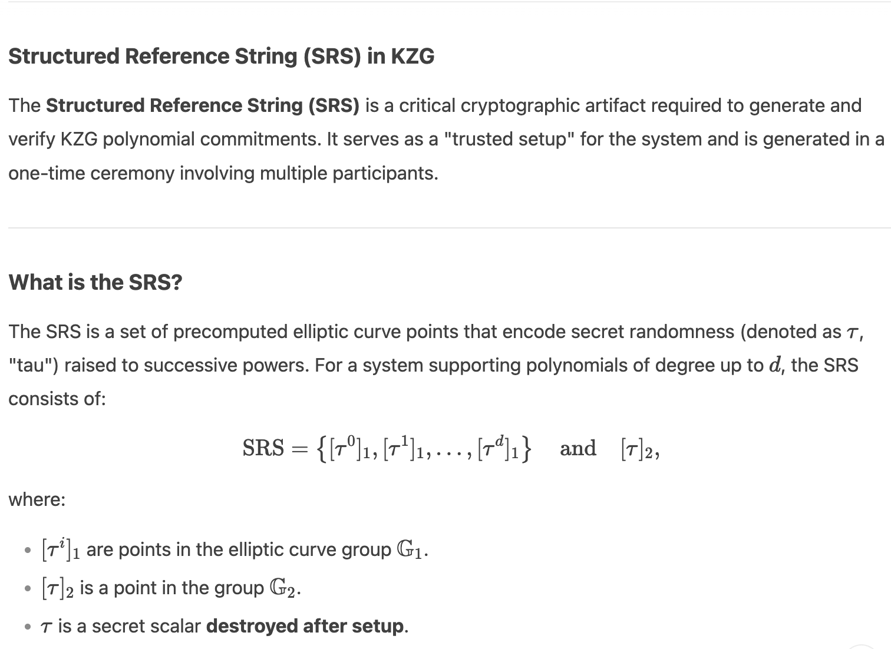
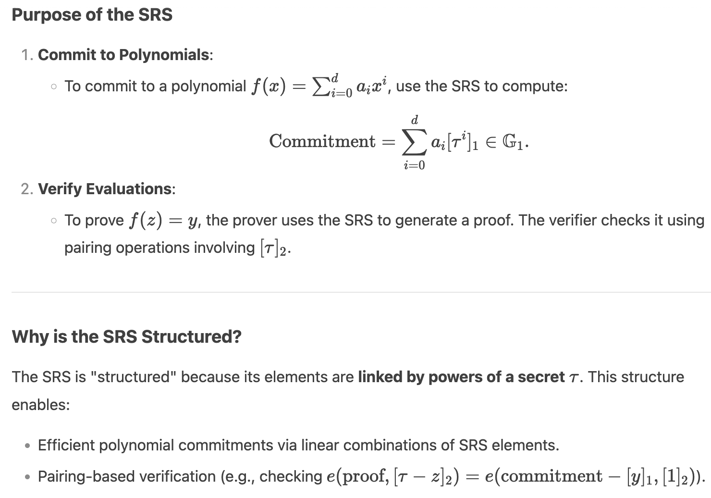
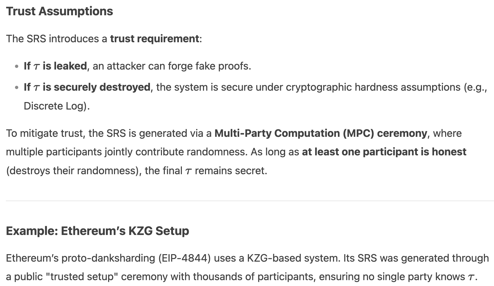
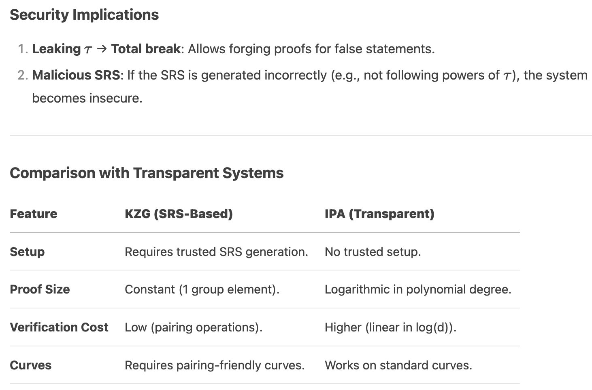

# PLONKish Arithmetization

The arithmetization used by Halo 2 comes from [PLONK](https://eprint.iacr.org/2019/953), or
more precisely its extension UltraPLONK that supports custom gates and lookup arguments. We'll
call it [***PLONKish***](https://twitter.com/feministPLT/status/1413815927704014850).

| Feature | PLONK | UltraPLONK |
| ------- | ----- | ---------- |
| Design Goal | Universal zk-SNARK protocol for general-purpose circuits. | Extends PLONK with custom gates and lookup arguments for specialized circuits. | 
| Core Idea | Uses a universal trusted setup and polynomial commitments to verify computations. | Retains PLONK’s foundation but adds support for domain-specific optimizations. | 
| Circuit Arithmetization | Represents circuits as polynomial constraints over a structured layout (e.g., rows/columns in a table). | Enhances arithmetization with customizable gates and lookup tables for complex operations. | 
| Gate Types | Fixed set of arithmetic gates (e.g., addition, multiplication). | Allows user-defined gates tailored to specific operations (e.g., XOR, range checks). | 
| Lookup Tables | Not natively supported. | Supports lookup arguments to verify values against precomputed tables (e.g., for bitwise ops). | 
| Flexibility | Limited to predefined constraints. | Highly flexible: developers can define custom gates and integrate lookup proofs. | 
| Efficiency | Optimized for general-purpose circuits. | Improved efficiency for specialized use cases (e.g., fewer constraints via custom gates). | 
| Polynomial Commitments | Relies on Kate (KZG) commitments or inner-product arguments. | Compatible with modern polynomial commitment schemes (e.g., IPA, Bulletproofs). | 
| Use Cases | Suitable for generic smart contracts and zero-knowledge proofs. |  proofs.	Ideal for complex protocols requiring specialized optimizations (e.g., zk-rollups, privacy chains). | 
| Prover Overhead | Higher for circuits requiring non-arithmetic operations. | Reduced overhead via custom gates (e.g., native support for cryptographic primitives). |

Key Differences: 
1. Custom Gates: UltraPLONK allows developers to define application-specific gates, reducing the number of constraints for repetitive operations. 
2. Lookup Arguments: UltraPLONK introduces lookup tables to verify relationships between variables and precomputed values, which PLONK lacks. 
3. Scalability: UltraPLONK’s optimizations enable more efficient proofs for complex circuits (e.g., SNARK-friendly hashing). 
4. Adoption: PLONK is a general-purpose framework, while UltraPLONK (via Halo 2) is widely used in production for blockchain systems (e.g., Ethereum’s zk-EVM). 

### Inner-Product Argument (IPA)
An inner-product argument is a cryptographic protocol that allows a prover to convince a verifier that they know two vectors $\vec{a}$ and $\vec{b}$ such that their inner product (dot product) equals a publicly claimed value $\vec{c}$, i.e., $\langle \vec{a}, \vec{b} \rangle = \sum_{i=1}^n a_i \cdot b_i = \vec{c}$, without revealing the vectors $\vec{a}$ or $\vec{b}$. This is a core building block in many zero-knowledge proof systems (e.g., Bulletproofs, Halo).

How It Works?
| Step | Description |
| ---- | ----------- |
| 1. Commitment Setup | a. The prover commits to the vectors $\vec{a}$ and $\vec{b}$ using cryptographic commitments (e.g., Pedersen vector commitments).  b. The verifier receives these commitments.  | 
| 2. Recursive Reduction | a. The prover and verifier interactively reduce the problem of proving $\langle \vec{a}, \vec{b} \rangle = \vec{c}$ to smaller instances of the same problem.  b. At each step, the vectors $\vec{a}$ and $\vec{b}$ are "folded" (split and combined) using challenges from the verifier, reducing their length by half. | 
| 3. Final Step | After $log(n)$ rounds (for vectors of length $n$), the prover reveals the final scalar values, and the verifier checks consistency with the original commitments. |

Key Properties?
| Property | Description |
| ------- | ----------- |
| Logarithmic Proof Size | The proof size scales with $O(\log n)$, making it efficient for large vectors. | 
| No Trusted Setup | Unlike KZG (Kate) commitments, IPAs do not require a trusted setup, making them trustless and transparent. |
| Polynomial Commitment | IPAs can act as a polynomial commitment scheme. For example, to commit to a polynomial $f(x)$, encode its coefficients as a vector and use IPA to prove evaluations or inner products. | 
| Verification Cost | Verification is more computationally intensive compared to KZG, but it avoids reliance on pairing-friendly curves. |

Pairing-Friendly Elliptic Curves? 
> Pairing-friendly elliptic curves are a special class of elliptic curves that enable efficient bilinear pairings (also called cryptographic pairings). These curves are essential for cryptographic protocols that rely on pairings, such as KZG (Kate) polynomial commitments, zk-SNARKs (e.g., Groth16), and identity-based encryption (IBE).

What is a Bilinear Pairing? 
> A bilinear pairing is a mathematical function: $e: G_1 \times G_2 \to G_T$ where: $G_1$, $G_2$ are Additive groups of points on an elliptic curve, $G_T$ is A multiplicative group in a finite field. 
The pairing satisfies bilinearity: $e(aP, bQ) = e(P, Q)^{ab}$ where $a$, $b$ are scalars and $P$, $Q$ are points. 
This property allows algebraic relationships to be "moved" between groups, enabling advanced cryptographic operations.

Why "Pairing-Friendly"?
> Not all elliptic curves support efficient pairings. Pairing-friendly curves are specifically engineered to: 
a. Enable bilinear pairings with practical computational cost. 
b. Balance security and efficiency: They have a carefully chosen embedding degree (a parameter linking the curve’s field to the target group $G_T$ ​ ). 
c. Resist cryptanalytic attacks (e.g., discrete log attacks on $G_T$ ​ ).

Key Properties of Pairing-Friendly Elliptic Curves?
| Property | Description |
| ------- | ----------- |
| Embedding Degree | a. Defines how the curve’s field relates to $G_T$.  b. Higher degrees enable smaller fields for the same security but increase pairing complexity.  c. Example curves: BN254 (embedding degree 12), BLS12-381 (embedding degree 12). | 
| Efficiency | Pairing computations on these curves are optimized for speed (e.g., using Miller’s algorithm). |
| Security | Must provide ~128-bit security against attacks (e.g., Pollard’s rho for discrete logs). | 

Examples of Pairing-Friendly Curves?
| Curve | Use Cases | Properties |
| ----- | --------- | ---------- |
| BN254 | zk-SNARKs (Groth16), KZG commitments. | Embedding degree 12, widely used in Ethereum. | 
| BLS12-381 | Zcash, Ethereum 2.0, Dfinity. | 	Larger field size, 128-bit security. |
| BLS24-315 | High-security applications. | Higher embedding degree for stronger security. |

Role in Cryptography of Pairing-Friendly Curves?
| Application | Description |
| ----------- | ----------- |
| KZG Commitments | a. Require pairings to verify polynomial evaluations (e.g., in PLONK).  b. Enable constant-sized proofs but depend on a trusted setup.  | 
| zk-SNARKs | Pairings are used to verify succinct proofs (e.g., Groth16). | 
| Aggregation Schemes | Pairings allow aggregating multiple signatures or proofs into one. |

Trade-offs vs. Non-Pairing Curves?
| Aspect | Pairing-Friendly Curves | Standard Curves (e.g., secp256k1) |
| ------- | ---------------------- | ------------------------------- |
| Cryptographic Power | Support pairings (KZG, zk-SNARKs). | Limited to ECDSA, Schnorr, etc. | 
| Trusted Setup | Required for KZG. | Not needed for ECC-based schemes. | 
| Efficiency | Pairings are computationally heavy. | Faster for basic operations. | 
| Security | Relies on newer assumptions (e.g., SXDH). | Well-tested (e.g., ECDLP). | 

Why Avoid Pairing-Friendly Curves?  
Protocols like IPA-based Halo 2 avoid pairing-friendly curves to: 
1. Eliminate trusted setups (pairing-based KZG needs a structured reference string). 
2. Use simpler curves (e.g., Pasta curves in Halo 2) with transparent security. 
3. Reduce hardware/software dependencies (pairings require complex libraries). 

However, pairing-based schemes (e.g., KZG) offer constant proof sizes and faster verification, making them preferable in some contexts.

Use Cases of IPA?
| Use Case | Description |
| -------- | ----------- |
| Bulletproofs | IPAs enable compact range proofs (e.g., proving a number lies in a range without revealing it). |
| Halo/Halo2 | Used in recursive proof composition (e.g., for blockchain scalability). | 
| ZKP Systems | Basis for polynomial commitments in transparent (non-trusted-setup) zk-SNARKs. |

Comparison with KZG?
| Feature | IPA | KZG |
| ------- | --- | --- |
| Trusted Setup | Not required (transparent). | Required (structured reference string). |
| Proof Size | $O(\log n)$ | Constant (1 group element).|
| Verification Cost | Higher (linear in $O(\log n)$). | Lower (constant-time pairings). |
| Curves | Works over standard elliptic curves. | Requires pairing-friendly curves. |

Discrete Log? 
TODO:

***PLONKish circuits*** are defined in terms of a rectangular matrix of values. We refer to
***rows***, ***columns***, and ***cells*** of this matrix with the conventional meanings.
