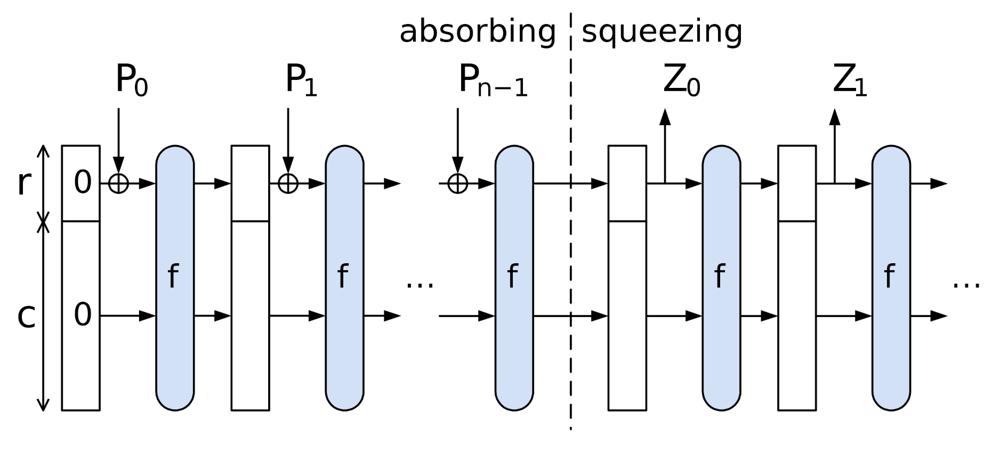

# The Poseidon algebraic hash function

- [Grain LFSR](#grain-lfsr)<br>
    - [Feedback Function](#feedback-function)<br>
        - [Uniform Distribution](#uniform-distribution)<br>
        - [Unit Test](#unit-test)<br>
- [Maximum Distance Seprarable Matrices(MDS)](#maximum-distance-seprarable-matricesmds)<br>
    - [The inverse of a Cauchy matrix](#the-inverse-of-a-cauchy-matrix)<br>
- [Constants and Matrices](#constants-and-matrices)<br>
    - [Galois Field (GF)](#galois-field-gf)<br>
    - [Pasta Elliptic Curves](#pasta-elliptic-curves)<br>
        - [Prime-order curves](#prime-order-curves)<br>
- [Relative struct or trait](#relative-struct-or-trait)<br>
    - [1. Domain](#1-domain)<br>
    - [2. Spec](#2-spec)<br>
    - [3. Sponge](#3-sponge)<br>
    - [4. Hash](#4-hash)<br>
## Grain LFSR
Some of the most common types of round constants are linear feedback shift registers (LFSRs). Grain LFSR (Linear Feedback Shift Register) is a critical component in the Grain family of stream ciphers, which includes Grain v0, Grain v1, and Grain-128 and has been historically used to generate round constants. This family of ciphers is designed for hardware applications and aims to maintain low hardware cost. The Grain LFSR, along with a Nonlinear Feedback Shift Register (NFSR) and a nonlinear filtering function, forms the basis of these ciphers.<br>

The LFSR in Grain provides a minimum period for the keystream, ensuring a certain level of security against attacks that exploit short periods. It operates on linear feedback principles, where the output is determined by a linear combination of previous bits in the register. This linear combination is defined by a feedback polynomial. The LFSR's role is to guarantee certain statistical properties and the non-repeating nature of the keystream.<br>

In contrast, the NFSR, which works alongside the LFSR, introduces nonlinearity into the system. This nonlinearity is crucial for cryptographic strength, as linear systems are generally easier to attack. The NFSR's output, along with the LFSR's output, is processed through a nonlinear filtering function to produce the final keystream bit.<br>

The specific construction and operation of the LFSR in Grain vary slightly between its different versions (v0, v1, and 128), primarily in terms of the length of the register and the feedback polynomial used. However, the underlying principle of providing a predictable, yet cryptographically secure, sequence of bits remains constant across all versions.<br>

`FieldType` Enum<br>
* Binary: Represents a binary field ( $\mathbb{F}_{2^n}$ ).
* PrimeOrder: Represents a prime-order field ( $\mathbb{F}_p$ ).
```rust
#[derive(Debug, Clone, Copy)]
pub(super) enum FieldType {
    /// GF(2^n)
    #[allow(dead_code)]
    Binary,
    /// GF(p)
    PrimeOrder,
}
/// The tag method returns a numeric identifier for the field type (0 for binary, 1 for prime-order).
impl FieldType {
    fn tag(&self) -> u8 {
        match self {
            FieldType::Binary => 0,
            FieldType::PrimeOrder => 1,
        }
    }
}
```
`SboxType` Enum<br>
Represents the type of S-box (non-linear transformation) used in Poseidon:<br>
* Pow: Represents the S-box type for raising elements to a power (e.g., $x^5$).
* Inv: Represents the S-box type for inversion (e.g., $x^{-1}$).
```rust
#[derive(Debug, Clone, Copy)]
pub(super) enum SboxType {
    /// x^alpha
    Pow,
    /// x^(-1)
    #[allow(dead_code)]
    Inv,
}
/// The tag method returns a numeric identifier for the S-box type (0 for Pow, 1 for Inv).
impl SboxType {
    fn tag(&self) -> u8 {
        match self {
            SboxType::Pow => 0,
            SboxType::Inv => 1,
        }
    }
}
```
`Grain` Struct<br>
```rust
/*
(Rust syntax)
Why Use pub(super)?
1. Encapsulation:
It allows you to expose an item to the parent module while keeping it hidden from other sibling or unrelated modules.
This is useful for maintaining a clean and controlled API surface.

2. Controlled Access:
You might want to make certain items accessible to the parent module for internal use but not expose them to the entire crate or other modules.

*/
use bitvec::prelude::*;
pub(super) struct Grain<F: Field> {
    /// An 80-bit array representing the internal state of the LFSR.
    state: BitArr!(for 80, in u8, Msb0),
    /// Tracks the position of the next bit to be output.
    next_bit: usize,
    /// A marker for the associated finite field type.
    _field: PhantomData<F>,
}
```
### Feedback Function
A feedback function in the context of a Linear Feedback Shift Register (LFSR) is a mathematical rule or operation that determines how the next bit(s) in the sequence are generated based on the current state of the LFSR. It is a critical component of the LFSR, as it defines how the internal state evolves over time.<br>

How the Feedback Function Works ?<br>
| Step | Description |
|------|-------------|
| 1. Input | a. The feedback function takes specific bits from the current state of the LFSR as input.<br> b. These bits are selected based on a feedback polynomial, which specifies the positions of the bits to be used. | 
| 2. Operation | a. The selected bits are combined using a mathematical operation, typically XOR (exclusive OR).<br> b. XOR is used because it is a simple, efficient, and non-linear operation that ensures the output bit depends on multiple bits of the state. | 
| 3. Output | a. The result of the XOR operation is the new bit that will be added to the LFSR's state.<br> b. This new bit is then shifted into the register, replacing the oldest bit, and the process repeats. |

Feedback Polynomial<br>
The feedback polynomial defines which bits of the LFSR's state are used in the feedback function. For example:<br> 
* A feedback polynomial like ( $x^{62} + x^{51} + x^{38} + x^{23} + x^{13} + x^0$ ) means that the feedback function will use the bits at positions `62, 51, 38, 23, 13, and 0` in the state.<br>

In the code:
```rust
new_bits |= ((self.state[i + 62]
    ^ self.state[i + 51]
    ^ self.state[i + 38]
    ^ self.state[i + 23]
    ^ self.state[i + 13]
    ^ self.state[i]) as u8)
    << i;
```
* The feedback function computes the XOR of the bits at positions `i + 62, i + 51, i + 38, i + 23, i + 13, and i` in the state.
* These positions correspond to the terms in the feedback polynomial.

Purpose of the Feedback Function ?<br>
| Purpose | Description |
|---------|-------------|
| State Evolution | The feedback function ensures that the LFSR's state evolves in a deterministic but pseudo-random manner. |
| Periodicity | A well-designed feedback function ensures that the LFSR produces a sequence with a long period (the number of steps before the sequence repeats).<br><br> Example of Periodicity:<br> Suppose an LFSR has a 3-bit state and a feedback polynomial that produces a sequence like this: 101 → 010 → 001 → 100 → 110 → 011 → 111 → 101 (repeats)<br> The period of this LFSR is 7, as it takes 7 steps to return to the initial state (101). |
| Randomness | The feedback function introduces pseudo-randomness into the sequence, making it suitable for cryptographic and other applications. |
| Security | In cryptographic applications, the feedback function ensures that the output sequence is unpredictable and resistant to attacks. |

1. What is a Period?<br>
* The period of an LFSR is the number of steps (or clock cycles) it takes for the LFSR to return to its initial state.
* Once the LFSR returns to its initial state, it will start generating the same sequence of bits again.
2. Why is a Long Period Important?<br>
* A short period means the sequence repeats quickly, making it predictable and insecure for cryptographic purposes.
* A long period ensures that the sequence appears random for a much longer time, making it harder to predict or exploit.
3. How is the Period Determined?<br>
* The period of an LFSR depends on its feedback polynomial and the initial state.
* A well-designed feedback polynomial ensures that the LFSR achieves its maximum period, which is ( $2^n - 1$ ), where ( $n$ ) is the number of bits in the LFSR.
* For example, an 80-bit LFSR with a well-designed feedback polynomial can produce a sequence of ( $2^{80} - 1$ ) bits before repeating.

`Grain::load_next_8_bits` Method
* Updates the LFSR state by generating 8 new bits based on a feedback function.
* The feedback function uses XOR operations on specific bits of the state.
```rust
impl<F: PrimeField> Grain<F> {
    fn load_next_8_bits(&mut self) {
        /*
            new_bits will store the 8 new bits generated by the feedback function.
            It is initialized to 0 and updated bit by bit in the loop.
        */
        let mut new_bits = 0u8;
        /*
            The new bit is computed as the XOR (^) of specific bits in the current state.
            These positions are chosen based on the feedback polynomial of the LFSR, which determines how the state evolves.
            The result of the XOR operation is cast to u8 and shifted left by i bits (<< i).
            This places the new bit in the correct position within the new_bits byte.
            The |= operator accumulates the new bit into new_bits.
        */
        for i in 0..8 {
            new_bits |= ((self.state[i + 62]
                ^ self.state[i + 51]
                ^ self.state[i + 38]
                ^ self.state[i + 23]
                ^ self.state[i + 13]
                ^ self.state[i]) as u8)
                << i;
        }
        /*
            Rotates the LFSR's state to the left by 8 bits.
            This effectively shifts the state, making room for the new bits to be added.
            The leftmost 8 bits are moved to the rightmost positions, and all other bits are shifted left by 8 positions.

            /// ## Examples
            ///
            /// let bits = bits![mut 0, 0, 1, 0, 1, 0];
            /// //      split occurs here ^
            /// bits.rotate_left(2);
            /// assert_eq!(bits, bits![1, 0, 1, 0, 0, 0]);
        */
        self.state.rotate_left(8);
        /*
            Tracks the position of the next bit to be output from the LFSR.
            Decreases by 8 because 8 new bits have been generated and added to the state.
        */
        self.next_bit -= 8;
        /*
            Purpose:

            Inserts the 8 new bits (new_bits) into the appropriate positions in the state.
            
            How It Works:

            Extract Each Bit:

            (new_bits >> i) & 1 extracts the i-th bit of new_bits.
            This is done by shifting new_bits right by i positions and masking with 1 to isolate the least significant bit.
            
            Update the State:

            self.state.get_mut(self.next_bit + i).unwrap() accesses the i-th position in the state (starting from next_bit).
            The extracted bit is stored in this position.
            
            Example:

            If new_bits = 0b10101010:
            The loop sets the bits at positions next_bit to next_bit + 7 in the state to [0, 1, 0, 1, 0, 1, 0, 1].
        */
        for i in 0..8 {
            *self.state.get_mut(self.next_bit + i).unwrap() = (new_bits >> i) & 1 != 0;
        }
    }
}    
```

`Grain::new` Method<br>
| Parameters | Description |
|------------|-------------|
| `sbox: SboxType`| Specifies the type of S-box (non-linear transformation) used in the Poseidon permutation. | 
| `t: u16` | Represents the width of the Poseidon state, i.e., the number of field elements in the state array. | 
| `r_f: u16` | a. Specifies the number of full rounds in the Poseidon permutation.<br> b. In a full round, the S-box is applied to all elements of the state, followed by the MDS matrix for mixing. | 
| `r_p: u16` | a. Specifies the number of partial rounds in the Poseidon permutation.<br> b. In a partial round, the S-box is applied to only one element of the state (usually the first element), followed by the MDS matrix. | 
```rust
use group::ff::{Field, FromUniformBytes, PrimeField};
const STATE: usize = 80;

impl<F: PrimeField> Grain<F> {
    pub(super) fn new(sbox: SboxType, t: u16, r_f: u16, r_p: u16) -> Self {
        // Initialize the LFSR state.
        /*
            1. LFSR State Initialization

            bitarr!:

            Creates a bit array to represent the internal state of the LFSR.
            The state is initialized with all bits set to 1.

            Msb0:

            Specifies that the most significant bit (MSB) is stored first in the bit array.
        */
        let mut state = bitarr![u8, Msb0; 1; STATE];
        /*
            2. Setting Bits in the LFSR State

            Purpose:

            Encodes specific parameters into the LFSR state by setting bits at specific positions.

            How It Works:

            * offset: The starting position in the bit array where the bits will be set.
            * len: The number of bits to set.
            * value: The value to encode into the bit array.
            * The loop iterates over the bits of value and sets them in reverse order (MSB-first) in the bit array.
        */
        let mut set_bits = |offset: usize, len, value| {
            // Poseidon reference impl sets initial state bits in MSB order.
            for i in 0..len {
                *state.get_mut(offset + len - 1 - i).unwrap() = (value >> i) & 1 != 0;
            }
        };

        /*
            4. Encoding Parameters into the LFSR State

            FieldType::PrimeOrder.tag():

            Encodes the field type (e.g., prime-order field ( \mathbb{F}_p )) into the first 2 bits.

            sbox.tag():

            Encodes the S-box type (e.g., (x^5) or (x^{-1})) into the next 4 bits.

            F::NUM_BITS:

            Encodes the number of bits in the finite field (F) (e.g., 255 bits for ( \mathbb{F}_p )) into 12 bits.

            t:

            Encodes the width of the Poseidon state into 12 bits.

            r_f and r_p:

            Encode the number of full and partial rounds into 10 bits each.
        */
        set_bits(0, 2, FieldType::PrimeOrder.tag() as u16);
        set_bits(2, 4, sbox.tag() as u16);
        /*
            /// How many bits are needed to represent an element of this field.
            const NUM_BITS: u32;
        */
        set_bits(6, 12, F::NUM_BITS as u16);
        set_bits(18, 12, t);
        set_bits(30, 10, r_f);
        set_bits(40, 10, r_p);

        /*
            5. Discarding Initial Bits

            Purpose:

            Discards the first 160 bits (20 bytes) of the LFSR output to ensure that the initial state does not leak information about the parameters.

            How It Works:

            The load_next_8_bits method generates 8 bits of output from the LFSR.
            This process is repeated 20 times to discard the first 160 bits.
        */
        let mut grain = Grain {
            state,
            /// Tracks the position of the next bit to be output.
            next_bit: STATE,
            _field: PhantomData::default(),
        };

        // Discard the first 160 bits.
        for _ in 0..20 {
            /*
                Why Reset next_bit to STATE? (TODO:)

                After calling grain.load_next_8_bits(), the internal state is updated with new bits, but the next_bit field must be reset to indicate that the entire state is available for reading again.
                By setting next_bit = STATE, the code ensures that the next call to get_next_bit will correctly start reading from the beginning of the updated state.
            */
            grain.load_next_8_bits();
            grain.next_bit = STATE;
        }

        grain
    }
}
```

`Grain::get_next_bit` Method
* Outputs the next bit from the LFSR.
* If all bits in the current state have been consumed, it generates `8` new bits using `load_next_8_bits`.
```rust
impl<F: PrimeField> Grain<F> {
    fn get_next_bit(&mut self) -> bool {
        /// const STATE: usize = 80;
        if self.next_bit == STATE {
            self.load_next_8_bits();
        }
        let ret = self.state[self.next_bit];
        self.next_bit += 1;
        ret
    }
}    
```

`Grain::next_field_element` Method
* Generates the next field element from the LFSR output.
* Uses rejection sampling to ensure the generated value is valid in the field.

Rejection Sampling<br>
* Rejection sampling is a technique used to generate valid samples from a specific distribution.
* In this case, the method ensures that the generated byte array represents a valid field element by discarding invalid values.

MSB vs. LSB Order<br>
* MSB Order:
    * Bits are interpreted starting from the most significant bit (leftmost).
    * This is the convention used in the Poseidon reference implementation.
* LSB Order:
    * Bits are interpreted starting from the least significant bit (rightmost).
    * The comment in the code explains that the implementation follows the Poseidon reference's MSB order for consistency.

```rust
impl<F: PrimeField> Grain<F> {
    /// Returns the next field element from this Grain instantiation.
    /// TODO: Currently, halo2 only call this function in test.
    pub(super) fn next_field_element(&mut self) -> F {
        // Loop until we get an element in the field.
        loop {
            /*
                1. Initialize a Default Representation
                Purpose:
                F::Repr is the internal representation of a field element in ( F ), typically a byte array.
                F::Repr::default() initializes this byte array to all zeros.
            */
            let mut bytes = F::Repr::default();

            // Poseidon reference impl interprets the bits as a repr in MSB order, because
            // it's easy to do that in Python. Meanwhile, our field elements all use LSB
            // order. There's little motivation to diverge from the reference impl; these
            // are all constants, so we aren't introducing big-endianness into the rest of
            // the circuit (assuming unkeyed Poseidon, but we probably wouldn't want to
            // implement Grain inside a circuit, so we'd use a different round constant
            // derivation function there).

            /*
                2. Interpret Bits in MSB Order

                Purpose:

                This loop fills the bytes array with bits generated by the LFSR, interpreting them in MSB (Most Significant Bit) order.
                How It Works:

                self.take(F::NUM_BITS as usize):
                This retrieves the next F::NUM_BITS bits from the LFSR, where F::NUM_BITS is the number of bits required to represent a field element in ( F ).

                enumerate():
                Iterates over the bits, providing both the index (i) and the bit value 
                (bit).

                Reverse Indexing:
                let i = F::NUM_BITS as usize - 1 - i; reverses the bit order to match the MSB-first convention.

                Set the Bit:
                view[i / 8] accesses the byte in the bytes array corresponding to the bit's position.
                1 << (i % 8) shifts 1 to the correct bit position within the byte.
                |= sets the bit if bit is true.

                Example:

                If F::NUM_BITS = 8 and the LFSR produces 0b10101010:
                The loop sets the bits in bytes as [0b10101010].
            */
            let view = bytes.as_mut();
            /*
                /// How many bits are needed to represent an element of this field.
                const NUM_BITS: u32;
            */
            for (i, bit) in self.take(F::NUM_BITS as usize).enumerate() {
                // If we diverged from the reference impl and interpreted the bits in LSB
                // order, we would remove this line.
                let i = F::NUM_BITS as usize - 1 - i;

                view[i / 8] |= if bit { 1 << (i % 8) } else { 0 };
            }
            /*
                3. Convert Bytes to a Field Element

                Purpose:

                Converts the bytes array into a field element ( f ) in ( F ).
                The from_repr_vartime method attempts to interpret the byte array as a valid field element.

                How It Works:

                F::from_repr_vartime(bytes):
                Tries to construct a field element from the byte array.
                Returns Some(f) if the byte array represents a valid field element.
                Returns None if the byte array is invalid (e.g., if it represents a value greater than or equal to the field's modulus).

                Rejection Sampling:

                If the byte array is invalid, the loop continues, and new bits are generated from the LFSR.
                This ensures that only valid field elements are returned.
            */
            if let Some(f) = F::from_repr_vartime(bytes) {
                break f;
            }
        }
    }
}    
```
Example Execution<br> 

Setup<br> 
* ( F ) is a finite field with ( F::NUM_BITS = 8 ).
* The LFSR produces the sequence: `0b10101010`.

Steps<br> 
1. Initialize bytes:
    * bytes = `[0b00000000]`.
2. Fill bytes:
    * The loop processes the bits in MSB order:
    
3. Convert to Field Element:
    * F::from_repr_vartime([0b10101010]) succeeds and returns a valid field element.
4. Return the Field Element:
    * The method returns the field element.

`Grain::next_field_element_without_rejection` Method    
This method generates the next field element from the Grain LFSR (Linear Feedback Shift Register) output without using rejection sampling. It directly converts the bits generated by the LFSR into a field element, even if the resulting value is not uniformly distributed within the field. This approach is used when uniform randomness is not required for security.<br>
* Generates the next field element without rejection sampling.
* This is used when uniform randomness is not required for security.
```rust
impl<F: FromUniformBytes<64>> Grain<F> {
    /// Returns the next field element from this Grain instantiation, without using
    /// rejection sampling.
    pub(super) fn next_field_element_without_rejection(&mut self) -> F {
        /*
            1. Initialize a 64-byte Array
            Purpose:
            Creates a 64-byte array (bytes) to store the bits generated by the LFSR.
            This array will later be used to construct a field element.
        */
        let mut bytes = [0u8; 64];

        // Poseidon reference impl interprets the bits as a repr in MSB order, because
        // it's easy to do that in Python. Additionally, it does not use rejection
        // sampling in cases where the constants don't specifically need to be uniformly
        // random for security. We do not provide APIs that take a field-element-sized
        // array and reduce it modulo the field order, because those are unsafe APIs to
        // offer generally (accidentally using them can lead to divergence in consensus
        // systems due to not rejecting canonical forms).
        //
        // Given that we don't want to diverge from the reference implementation, we hack
        // around this restriction by serializing the bits into a 64-byte array and then
        // calling F::from_bytes_wide. PLEASE DO NOT COPY THIS INTO YOUR OWN CODE!
        let view = bytes.as_mut();
        for (i, bit) in self.take(F::NUM_BITS as usize).enumerate() {
            // If we diverged from the reference impl and interpreted the bits in LSB
            // order, we would remove this line.
            let i = F::NUM_BITS as usize - 1 - i;

            view[i / 8] |= if bit { 1 << (i % 8) } else { 0 };
        }
        /*
            3. Convert Bytes to a Field Element

            Purpose:

            Converts the 64-byte array (bytes) into a field element ( F ) using the from_uniform_bytes method.

            How It Works:

            F::from_uniform_bytes(&bytes):
            Interprets the 64-byte array as a large integer.
            Reduces this integer modulo the field's prime modulus ( p ) to produce a valid field element.

            This method does not perform rejection sampling, so the resulting field element may not be uniformly distributed.

            /// Returns a field element that is congruent to the provided little endian unsigned
            /// byte representation of an integer.
            fn from_uniform_bytes(bytes: &[u8; N]) -> Self;
        */
        F::from_uniform_bytes(&bytes)
    }
}
```

The difference between `next_field_element` and `next_field_element_without_rejection`
| Feature | `next_field_element_without_rejection` | `next_field_element` |
|---------|----------------------------------------|----------------------|
| Rejection Sampling | No | Yes |
| Uniform Distribution | Not guaranteed | Guaranteed |
| Performance | Faster (no rejection loop) | Slower (due to rejection loop) |
| Use Case | Non-critical randomness (e.g., constants) | Critical randomness (e.g., cryptography) | 
| Method for Conversion | `F::from_uniform_bytes` | `F::from_repr_vartime` |
| Security | Lower (non-uniform values may be insecure) | Higher (uniform values ensure security) | 

`Iterator` for Grain<br>
This code implements the `Iterator` trait for the Grain<F> struct, allowing it to produce a sequence of boolean values (`true` or `false`) based on the internal state of the Grain LFSR (Linear Feedback Shift Register). The next method defines how the iterator generates the next value in the sequence.

* The Iterator implementation for Grain<F> produces a sequence of pseudo-random bits using a self-shrinking mechanism.
* It ensures that only bits following a 1 are output, improving randomness.
* This is a critical component for cryptographic applications, particularly in the context of the Poseidon hash function.

What is Self-Shrinking ?<br> 
* Self-shrinking is a mechanism used in pseudo-random bit generators, such as the Grain LFSR (Linear Feedback Shift Register), to improve the randomness of the output sequence. It works by evaluating bits in pairs and selectively discarding some bits based on the value of the first bit in each pair.

How Self-Shrinking Works ?<br>
1. Evaluate Bits in Pairs:<br>
    * The generator produces bits sequentially.
    * For every two bits generated (a pair), the first bit determines what happens to the second bit:
        * If the first bit is 1, the second bit is output.
        * If the first bit is 0, the second bit is discarded.
2. Repeat the Process:<br>
    * The generator continues to evaluate the next pair of bits and applies the same rule.
3. Effect:<br>
    * The output rate is reduced (not all bits are used), but the randomness of the output is improved because the process removes predictable patterns.

```rust
impl<F: PrimeField> Iterator for Grain<F> {
    /*
        Specifies that the iterator will produce items of type bool.
        Each item represents a single bit (true for 1, false for 0) generated by the Grain LFSR.
    */
    type Item = bool;

    fn next(&mut self) -> Option<Self::Item> {
        // Evaluate bits in pairs:
        // - If the first bit is a 1, output the second bit.
        // - If the first bit is a 0, discard the second bit.
        while !self.get_next_bit() {
            self.get_next_bit();
        }
        Some(self.get_next_bit())
    }
}
```

#### Uniform Distribution
Uniform distribution refers to the property that all possible values in a given range or set are equally likely to occur. In the context of cryptography and finite fields, a uniformly distributed field element means that every valid element in the field has an equal probability of being generated.<br>

Why Uniform Distribution Matters ?<br>
1. Cryptographic Security:<br>
    * Uniform distribution ensures that the generated values are unpredictable and do not exhibit patterns that attackers could exploit.
    * For example, in cryptographic protocols like zero-knowledge proofs or digital signatures, non-uniform values could leak information about private keys or other sensitive data.
2. Fairness:<br>
    * Uniform distribution guarantees that no specific value is favored over others, which is critical for ensuring fairness in applications like random number generation or lotteries.
3. Avoiding Bias:<br>
    * Non-uniform distributions introduce bias, meaning some values are more likely to occur than others. This can weaken the security of cryptographic systems.

#### Unit Test
The provided test code is a unit test for the Grain struct, which is part of the Poseidon hash function implementation. The test verifies that the Grain LFSR (Linear Feedback Shift Register) can be initialized and used to generate a field element.

```rust
/*
    The #[cfg(test)] attribute indicates that this module is only compiled and run during testing.
*/
#[cfg(test)]
mod tests {
    use pasta_curves::Fp;

    use super::{Grain, SboxType};
    /*
        Marks this function as a test case.
        The test framework will automatically run this function during testing.
    */
    #[test]
    fn grain() {
        /*
            Initializes a new Grain LFSR instance with the following parameters:
            SboxType::Pow: Specifies that the S-box used in Poseidon is ( x^\alpha ) (e.g., ( x^5 )).
            3: The state width of the Poseidon permutation (number of elements in the state).
            8: The number of full rounds in the Poseidon permutation.
            56: The number of partial rounds in the Poseidon permutation.
        */
        let mut grain = Grain::<Fp>::new(SboxType::Pow, 3, 8, 56);
        let _f = grain.next_field_element();
    }
}
```

## Maximum Distance Seprarable Matrices(MDS)
* Maximum Distance Seprarable Matrices(MDS) are commonly used in the linear layer of hash functions. It's used in the linear mixing step of cipher algorithms to ensure a high level of diffusion, meaning that a change in a single input bit will affect many output bits. This contributes to the cipher's security by making it resistant to certain types of cryptanalytic attacks. MDS matrices are designed so that any subset of rows (or columns) forms a linearly independent set, maximizing the spread of input differences across the cipher's state.
* The mathematical notion of linear independence refers to a set of vectors in which no vector can be represented as a linear combination of the others. This means that each vector adds a new dimension to the space spanned by the set. For example, in a three-dimensional space, three vectors are linearly independent if none of them lies in the plane formed by the other two. This concept is crucial in many areas of mathematics and is fundamental in understanding the behavior of systems of linear equations and transformations.

This code implements the generate_mds function, which generates a Maximum Distance Separable (MDS) matrix and its inverse for use in the Poseidon hash function. The MDS matrix is a key component of the Poseidon permutation, ensuring diffusion (mixing) of the state elements.
```rust
/*
    1. Function Signature

    F: Represents the finite field type. It must implement:
        FromUniformBytes<64>: Allows generating field elements from uniform bytes.
        Ord: Ensures field elements can be ordered (used for uniqueness checks).
    T: The size of the MDS matrix (a ( T * T ) matrix).
    grain: A mutable reference to a Grain instance, which generates pseudo-random field elements.
    select: A counter used to skip a fixed number of MDS matrices before selecting one (used for ensuring security). TODO:
    Return Value: A tuple containing:
        The generated MDS matrix (Mds<F, T>).
        The inverse of the MDS matrix (Mds<F, T>).
*/
pub(super) fn generate_mds<F: FromUniformBytes<64> + Ord, const T: usize>(
    grain: &mut Grain<F>,
    mut select: usize,
) -> (Mds<F, T>, Mds<F, T>) {
    let (xs, ys, mds) = loop {
        /*
            2. Generating Unique Field Elements

            Purpose: Generates two arrays of ( T ) unique field elements (xs and ys).
            
            Steps:
            Generate ( 2T ) field elements using the Grain LFSR.
            Check if all elements are unique:
                Clone and sort the elements.
                Remove duplicates using dedup.
                If the number of unique elements matches the original count, split the array into two halves:
                    xs: The first ( T ) elements.
                    ys: The second ( T ) elements.
        */
        // Generate two [F; T] arrays of unique field elements.
        let (xs, ys) = loop {
            let mut vals: Vec<_> = (0..2 * T)
                .map(|_| grain.next_field_element_without_rejection())
                .collect();

            // Check that we have unique field elements.
            let mut unique = vals.clone();
            unique.sort_unstable();
            unique.dedup();
            if vals.len() == unique.len() {
                let rhs = vals.split_off(T);
                break (vals, rhs);
            }
        };

        /*
            3. Ensuring MDS Security

            Purpose: Ensures that the generated MDS matrix satisfies cryptographic security requirements.
            
            How It Works:
                The select counter determines how many MDS matrices to skip before selecting one.
                This is based on pre-determined security checks performed out-of-band (e.g., using a Sage reference implementation).
        */

        // We need to ensure that the MDS is secure. Instead of checking the MDS against
        // the relevant algorithms directly, we witness a fixed number of MDS matrices
        // that we need to sample from the given Grain state before obtaining a secure
        // matrix. This can be determined out-of-band via the reference implementation in
        // Sage. ([pasta-hadeshash](https://github.com/daira/pasta-hadeshash))
        if select != 0 {
            select -= 1;
            continue;
        }

        /*
            4. Generating the MDS Matrix

            Purpose: Constructs a ( T \times T ) Cauchy matrix, which serves as the MDS matrix.

            Steps:
                Compute each element ( a_{ij} ) of the matrix as: [ a_{ij} = \frac{1}{x_i + y_j}, \quad x_i + y_j \neq 0 ]
                Ensure that ( x_i + y_j \neq 0 ) using assert!.
                Compute the multiplicative inverse of ( x_i + y_j ) to populate the matrix.
        */

        // Generate a Cauchy matrix, with elements a_ij in the form:
        //     a_ij = 1/(x_i + y_j); x_i + y_j != 0
        //
        // It would be much easier to use the alternate definition:
        //     a_ij = 1/(x_i - y_j); x_i - y_j != 0
        //
        // These are clearly equivalent on `y <- -y`, but it is easier to work with the
        // negative formulation, because ensuring that xs ∪ ys is unique implies that
        // x_i - y_j != 0 by construction (whereas the positive case does not hold). It
        // also makes computation of the matrix inverse simpler below (the theorem used
        // was formulated for the negative definition).
        //
        // However, the Poseidon paper and reference impl use the positive formulation,
        // and we want to rely on the reference impl for MDS security, so we use the same
        // formulation.
        let mut mds = [[F::ZERO; T]; T];
        /*
            The #[allow(clippy::needless_range_loop)] attribute in Rust is used to suppress a specific Clippy lint warning. In this case, it suppresses the needless_range_loop lint, which is triggered when a for loop iterates over a range (e.g., 0..n) but could be rewritten to iterate directly over an iterator or collection.
        */
        #[allow(clippy::needless_range_loop)]
        for i in 0..T {
            for j in 0..T {
                let sum = xs[i] + ys[j];
                // We leverage the secure MDS selection counter to also check this.
                assert!(!sum.is_zero_vartime());
                mds[i][j] = sum.invert().unwrap();
            }
        }

        break (xs, ys, mds);
    };

    /*
        5. Computing the Inverse of the MDS Matrix

        This code computes the inverse of an MDS (Maximum Distance Separable) matrix using the mathematical properties of Cauchy matrices. The inverse is calculated based on Lagrange polynomials and the structure of the Cauchy matrix.

        Purpose: Computes the inverse of the MDS matrix using a formula for the inverse of a Cauchy matrix.

        Steps:
            Define a helper function l to compute Lagrange polynomials for xs and ys.
            Negate the ys array to adapt the formula for the positive Cauchy matrix.
            Compute each element ( b_{ij} ) of the inverse matrix as: [ b_{ij} = (x_j - (-y_i)) A_j(-y_i) B_i(x_j) ] where ( A_j(x) ) and ( B_i(x) ) are Lagrange polynomials.
    */

    // Compute the inverse. All square Cauchy matrices have a non-zero determinant and
    // thus are invertible. The inverse for a Cauchy matrix of the form:
    //
    //     a_ij = 1/(x_i - y_j); x_i - y_j != 0
    //
    // has elements b_ij given by:
    //
    //     b_ij = (x_j - y_i) A_j(y_i) B_i(x_j)    (Schechter 1959, Theorem 1)
    //
    // where A_i(x) and B_i(x) are the Lagrange polynomials for xs and ys respectively.
    //
    // We adapt this to the positive Cauchy formulation by negating ys.

    /*
        Purpose: Initializes the inverse MDS matrix (mds_inv) as a ( T \times T ) matrix filled with zeros.
        Type: Each element of the matrix is a field element of type F.
    */
    let mut mds_inv = [[F::ZERO; T]; T];
    /*
        Purpose: Computes the Lagrange polynomial ( A_j(x) ) or ( B_i(x) ) for the given set of points xs.

        Parameters:
        xs: The set of points (either xs or ys).
        j: The index of the point for which the Lagrange polynomial is being computed.
        x: The value at which the polynomial is evaluated.

        Steps:
        Exclude the j-th Point:
            The Lagrange polynomial excludes the j-th point from the computation.
        Compute the Product:
            For each other point ( x_m ), compute: [ \frac{x - x_m}{x_j - x_m} ]
            Multiply these terms together to compute the Lagrange polynomial.
        Invert the Denominator:
            The denominator ( x_j - x_m ) is inverted using denominator.invert().unwrap().
            This is safe because the elements of xs are guaranteed to be distinct.

        1. xs
        Type: &[F] (a slice of field elements).
        Purpose: Represents the set of points (either xs or ys) used to compute the Lagrange polynomial.
        Role: The iter() method creates an iterator over the elements of xs.

        2. .enumerate()
        Purpose: Converts the iterator into an iterator of (index, value) pairs.
        Role: Allows access to both the index (m) and the value (x_m) of each element in xs.

        3. fold(F::ONE, |acc, (m, x_m)| { ... })
        Purpose: Aggregates a value by iterating over the elements of xs and applying a closure.
        Parameters:
        F::ONE: The initial value of the accumulator (acc). It represents the multiplicative identity in the field ( \mathbb{F}_p ).
        |acc, (m, x_m)| { ... }: The closure that updates the accumulator for each element in xs.

        4. acc
        Type: F (a field element).
        Purpose: Represents the accumulated product of terms in the Lagrange polynomial.
        Role: Starts as F::ONE and is updated in each iteration by multiplying with the current term.

        5. (m, x_m)
        m: The index of the current element in xs.
        x_m: The value of the current element in xs.
        Purpose: Used to compute the Lagrange polynomial by iterating over all elements of xs.

        6. j
        Type: usize (an index).
        Purpose: Represents the index of the point being excluded from the Lagrange polynomial computation.
        Role: Ensures that the j-th point is skipped in the computation.

        7. x
        Type: F (a field element).
        Purpose: The value at which the Lagrange polynomial is being evaluated.
        Role: Used in the numerator of the Lagrange polynomial.

        How It Works ？

        Iterate Over xs:
        The enumerate() method provides both the index (m) and the value (x_m) of each element in xs.

        Skip the j-th Point:
        The if m == j condition ensures that the j-th point is excluded from the computation.

        Compute the Term:
        For each other point ( x_m ), compute: [ \frac{x - x_m}{x_j - x_m} ]
        Numerator: ( x - x_m ).
        Denominator: ( x_j - x_m ), which is inverted using denominator.invert().unwrap().

        Update the Accumulator:
        Multiply the current accumulator (acc) with the computed term.

        Return the Final Product:
        After iterating over all points in xs (except the j-th point), the result is the Lagrange polynomial ( A_j(x) ).
    */
    let l = |xs: &[F], j, x: F| {
        let x_j = xs[j];
        xs.iter().enumerate().fold(F::ONE, |acc, (m, x_m)| {
            if m == j {
                acc
            } else {
                // We hard-code the type, to avoid spurious "cannot infer type" rustc errors.
                let denominator: F = x_j - x_m;

                // We can invert freely; by construction, the elements of xs are distinct.
                let denominator_inverted: F = denominator.invert().unwrap();

                acc * (x - x_m) * denominator_inverted
            }
        })
    };
    let neg_ys: Vec<_> = ys.iter().map(|y| -*y).collect();
    for i in 0..T {
        for j in 0..T {
            mds_inv[i][j] = (xs[j] - neg_ys[i]) * l(&xs, j, neg_ys[i]) * l(&neg_ys, i, xs[j]);
        }
    }

    (mds, mds_inv)
}
```

### The inverse of a Cauchy matrix

[Cauchy matrix](https://en.wikipedia.org/wiki/Cauchy_matrix)

The reason for multiplying by two Lagrange polynomials (l(&xs, j, $neg_{ys}[i]$) and l(&$neg_{ys}$, i, xs[j])) is due to the mathematical properties of the inverse of a Cauchy matrix. Specifically, the formula for the inverse of a Cauchy matrix involves two Lagrange polynomials to account for the relationships between the rows and columns of the matrix.

1. Cauchy Matrix and Its Inverse<br>
A Cauchy matrix is defined as:

$[ a_{ij} = \frac{1}{x_i - y_j}, \quad x_i - y_j \neq 0 ]$

The inverse of a Cauchy matrix is given by:

$[ b_{ij} = (x_j - y_i) \cdot A_j(y_i) \cdot B_i(x_j) ]$

Where:

* ($ A_j(y_i)$ ) is the Lagrange polynomial for the ( $j$ )-th column, evaluated at ( $y_i$ ).
* ( $B_i(x_j)$ ) is the Lagrange polynomial for the ( $i$ )-th row, evaluated at ( $x_j$ ).

2. Why Two Lagrange Polynomials?<br> 
    * First Lagrange Polynomial: ( l(&xs, j, $neg_{ys}[i]$) )<br>
        * This corresponds to ( $A_j(y_i)$ ), the Lagrange polynomial for the ( $j$ )-th column.
        * It ensures that the inverse matrix element ( $b_{ij}$ ) correctly accounts for the relationship between the ( $j$ )-th column of the original matrix and the ( $i$ )-th row of the inverse matrix.
    * Second Lagrange Polynomial: ( l(&$neg_{ys}$, i, xs[j]) )<br>
        * This corresponds to ( $B_i(x_j)$ ), the Lagrange polynomial for the ( $i$ )-th row.
        * It ensures that the inverse matrix element ( $b_{ij}$ ) correctly accounts for the relationship between the ( $i$ )-th row of the original matrix and the ( $j$ )-th column of the inverse matrix.
    * Combined Effect
        * The product of the two Lagrange polynomials ensures that the inverse matrix element ( $b_{ij}$ ) satisfies the mathematical properties of the inverse of a Cauchy matrix.
        * This guarantees that the matrix multiplication of the original matrix and its inverse results in the identity matrix.

## Constants and Matrices
There are two kinds of constants for the Poseidon in halo2.<br>
| Type | Description | File |
|------|-------------|-------------|
| pallas::Base | Constants for using Poseidon with the Pallas field. | halo2_poseidon/src/fp.rs |
| vesta::Base | Constants for using Poseidon with the Vesta field. | halo2_poseidon/src/fp.rs |

The constants and matrices in this code are precomputed and hardcoded for efficiency. Take the pallas::Base type as an example, they include:
| Type | Description | Purpose | Structure in halo2 | Representation in halo2 | 
|------|-------------|-------------|-------------|-------------|
| Round Constants (ROUND_CONSTANTS) | Used in each round of the Poseidon permutation to ensure cryptographic security. | a. Round constants are added to the state in each round of the Poseidon permutation.<br> b. They ensure that the permutation is unique for each round, preventing attacks that exploit symmetry or predictability in the permutation. | a 2D array with 64 rows and 3 columns:<br> a. Each row corresponds to a single round of the Poseidon permutation.<br> b. Each column corresponds to one element of the state (the state has 3 elements in this configuration). | Each constant is represented as a `pallas::Base` element, which is an element of the finite field over which the Pallas curve is defined. | 
| MDS Matrix (MDS) | A mixing matrix that ensures diffusion across the state. | a. The Maximum Distance Separable (MDS) matrix is a linear transformation applied to the state in each round of the Poseidon permutation.<br> b. It ensures diffusion, meaning that every element of the state influences every other element. This is critical for cryptographic security. | a. a 3x3 matrix, where each element is a `pallas::Base` field element.<br> b. The matrix is applied to the state using matrix multiplication: new_state[i] = $\sum_{j=0}^{2} \text{MDS}[i][j] \cdot \text{state}[j]$ | a. The MDS matrix is carefully chosen to maximize diffusion while being efficient to compute.<br> b. It is invertible, which ensures that the Poseidon permutation is reversible (a requirement for cryptographic permutations). |
| Inverse MDS Matrix (MDS_INV) | The inverse of the MDS matrix, which may be used in certain applications. | a. The inverse MDS matrix is the inverse of the MDS matrix.<br> b. It may be used in certain applications where the inverse transformation is required, such as in cryptographic protocols that involve reversing the Poseidon permutation. | a. a 3x3 matrix, with each element being a `pallas::Base` field element.<br> b. It satisfies the property: $[ MDS_INV \cdot MDS = I ]$ where ( $I$ ) is the identity matrix. | 

How to create these constants and matrices ?<br>
* The constants in this file can be reproduced using a Sage script provided in the [pasta-hadeshash](https://github.com/daira/pasta-hadeshash) repository. The script generates the round constants and MDS matrix based on the Posei don specification.
```bash
$ sage generate_parameters_grain.sage 1 0 255 3 8 56 0x40000000000000000000000000000000224698fc094cf91b992d30ed00000001
```
Parameters Introduction （[parameters](https://github.com/daira/pasta-hadeshash/blob/master/code/parameters.txt)
| Parameter | Description |
|-----------|-------------|
| 1 - $GF(p)$ | a. GF(p) refers to a Galois Field of prime order p.<br> b. Specifies that the Poseidon hash function will operate over a prime field ( $\mathbb{F}_p$ ).<br> c. ( $\mathbb{F}_p$ ) is a finite field where arithmetic is performed modulo a prime number ( $p$ ). | 
| 0 - $x^\alpha$ | a. Specifies the S-box used in the Poseidon permutation.<br> b. $x^\alpha$ is the non-linear transformation applied to elements of the state during the permutation.<br> c. In this case, 0 indicates that the S-box is ( x^5 ), which is efficient in finite fields and provides strong non-linearity. | 
| 255 - Field Size in Bits | a. Specifies the size of the field in bits.<br> b. The field size is 255 bits, meaning the prime ( $p$ ) defining the field is a 255-bit number. | 
| 3 - Width | a. Specifies the width of the Poseidon state, i.e., the number of elements in the state.<br> b. A width of 3 means the state consists of 3 field elements. |
| 8 - $R_F$ | a. Specifies the number of full rounds in the Poseidon permutation.<br> b. In a full round: The S-box is applied to all elements of the state. The MDS matrix is applied to mix the state.<br> c. Full rounds ensure strong non-linearity across the entire state. | 
| 56 - $R_P$ | a. Specifies the number of partial rounds in the Poseidon permutation.<br> b. In a partial round: The S-box is applied to only the first element of the state. The MDS matrix is applied to mix the state.<br> c. Partial rounds reduce computational cost while maintaining sufficient non-linearity and diffusion. |
| 0x40000000000000000000000000000000224698fc094cf91b992d30ed00000001 - Field Size | a. Specifies the prime ( $p$ ) that defines the finite field ( $\mathbb{F}_p$ ).<br> b. This is a 255-bit prime number: [ $p = 2^{254} + 0x224698fc094cf91b992d30ed00000001$ ]<br> c. All arithmetic operations (addition, multiplication, etc.) in the Poseidon hash function are performed modulo this prime. |

### Galois Field (GF)
A Galois Field (GF), named after the mathematician Évariste Galois, is a finite field that contains a finite number of elements. It is a fundamental concept in mathematics and is widely used in cryptography, error correction codes, and other areas of computer science and engineering.<br>

Key Properties of Galois Fields<br>
1. Finite Number of Elements:<br>
    * A Galois Field contains a finite number of elements, denoted as `q`.<br>
    * The size of the field is always a power of a prime number: $q = p^n$, where:<br>
        * `p` is a prime number (the characteristic of the field).
        * `n` is a positive integer (the degree of the field).
2. Field Properties:<br>
    * A Galois Field satisfies all the properties of a field:
        * Closure: Addition, subtraction, multiplication, and division (except by zero) always produce elements within the field.
        * Associativity: Operations are associative.
        * Commutativity: Addition and multiplication are commutative.
        * Identity Elements: There are additive (0) and multiplicative (1) identities.
        * Inverses: Every non-zero element has a multiplicative inverse.
3. Two Types of Galois Fields:<br>
    * GF(p): A Galois Field with `p` elements, where `p` is a prime number.
        * Example: GF(7) contains `{0, 1, 2, 3, 4, 5, 6}` with arithmetic modulo `7`.
    * GF($p^n$): A Galois Field with $p^n$ elements, where `n > 1`.
        * These fields are extensions of GF(p) and are used in more complex applications like cryptography and error correction.

Examples of Galois Fields<br>
1. GF(2)
    * The simplest Galois Field with two elements: `{0, 1}`.         
    * Arithmetic is performed modulo `2`:
        * Addition: `0 + 0 = 0`, `1 + 1 = 0`, `0 + 1 = 1`, `1 + 0 = 1`.
        * Multiplication: `0 * 0 = 0`, `1 * 1 = 1`, `0 * 1 = 0`, `1 * 0 = 0`.
2. GF(7)
    * A prime-order field with seven elements: `{0, 1, 2, 3, 4, 5, 6}`.
    * Arithmetic is performed modulo `7`:
        * Addition: `(3 + 5) mod 7 = 1`, `4 + 6 = 3`.
        * Multiplication: `2 * 3 = 6`, `(4 * 6) mod 7 = 3`.
3. GF($2^3$)
    * A field with `2^3 = 8` elements.
    * Elements are represented as polynomials of degree less than `3` over GF(2), such as `{0, 1, x, x+1, x^2, x^2+1, x^2+x, x^2+x+1}`.
        * The polynomial `x^2 + x + 1` is valid because the coefficients of `x^2`, `x`, and the constant term are all either `0` or `1`.
        * A polynomial like `2x^2 + x + 3` is not valid in GF(2) because coefficients must be reduced modulo `2`, resulting in `0x^2 + x + 1` (or simply `x + 1`).
    * Arithmetic is performed modulo an irreducible polynomial, such as `x^3 + x + 1`.
        * An irreducible polynomial in the context of finite fields like GF($2^3$) is a polynomial that cannot be factored into smaller polynomials over GF(2). It plays a critical role in defining the field extension GF($2^n$), as it is used to perform modular arithmetic on polynomials to ensure the field has exactly $2^n$ elements.

How is the irreducible polynomial selected?<br>
1. Properties of the Polynomial:
    * The irreducible polynomial must have a degree equal to `n` (e.g., degree `3` for GF($2^3$)).
    * It must be irreducible over GF(2), meaning it cannot be factored into two non-constant polynomials with coefficients in GF(2).
2. Examples:
    * For GF($2^3$), a common irreducible polynomial is `x^3 + x + 1`.
    * This polynomial is irreducible because it cannot be factored into smaller polynomials over GF(2).
3. Selection Process:
    * The irreducible polynomial is typically chosen during the design of the cryptographic system or algorithm that uses the finite field.
    * The choice is often made to ensure efficiency in arithmetic operations and compatibility with the specific application.

When is the irreducible polynomial selected?<br>
* The irreducible polynomial is selected once during the definition of the finite field GF($2^n$).
* It is fixed for the specific implementation of the field and does not change during runtime.
* For example, in cryptographic systems like AES or Poseidon, the irreducible polynomial is predefined and hardcoded into the implementation.

### Pasta Elliptic Curves
The Pasta elliptic curves are a pair of cryptographic curves designed for use in zero-knowledge proofs (ZKPs) and other cryptographic applications. These curves are specifically optimized for efficiency and security in zk-SNARKs (Zero-Knowledge Succinct Non-Interactive Arguments of Knowledge) and recursive proof systems.<br>

Key Features of Pasta Curves:<br>
| Feature | Description |
|---------|-------------|
| Cycle-Friendly Curves | a. Pasta curves consist of two elliptic curves:<br> a.1. Pallas: Defined over the scalar field of the Vesta curve.<br> a.2. Vesta: Defined over the scalar field of the Pallas curve.<br> b. These curves form a "curve cycle", meaning the scalar field of one curve is the base field of the other. This property is particularly useful for recursive proof systems, where one proof verifies another proof. | 
| Prime-Order Curves | Both Pallas and Vesta are prime-order curves, which ensures strong security properties for cryptographic operations. | 
| Finite Field Arithmetic | The curves are defined over finite fields, enabling efficient arithmetic operations required for cryptographic computations. | 
| Optimized for zk-SNARKs | a. Pasta curves are designed to be efficient in zk-SNARK systems like Halo 2, which is a proving system for zero-knowledge proofs.<br> b. They are optimized for performance in both proof generation and verification. |
| Security | The curves are designed to provide strong security guarantees against known cryptographic attacks, such as those targeting elliptic curve discrete logarithms. |

#### Prime-order curves
Prime-order curves ensure strong security properties for cryptographic operations because of the following reasons:<br> 
| Reason | Description | Why is this important? | 
|--------|-------------|-------------|
| No Small Subgroups | a. A prime-order curve has a group order ( q ), where ( q ) is a prime number.<br> b. This ensures that the only subgroups of the curve are the trivial subgroup (containing just the identity element) and the entire group itself. | a. In cryptographic operations, small subgroups can lead to vulnerabilities such as small subgroup attacks, where an attacker exploits the existence of small subgroups to gain information about private keys.<br> b. Prime-order curves eliminate this risk because there are no small subgroups. |
| Uniform Distribution of Points | a. On a prime-order curve, every non-identity point generates the entire group when multiplied by integers (i.e., it is a generator of the group).<br> b. This ensures that the points on the curve are uniformly distributed, which is critical for cryptographic protocols like Diffie-Hellman key exchange and Elliptic Curve Digital Signature Algorithm (ECDSA). | Uniform distribution ensures that cryptographic operations are resistant to statistical attacks, where an attacker might exploit non-uniformity to predict private keys. | 
| Hardness of the Discrete Logarithm Problem (DLP) | a. The security of elliptic curve cryptography (ECC) relies on the Elliptic Curve Discrete Logarithm Problem (ECDLP), which is the problem of finding ( $k$ ) given ( $P$ ) and ( $Q = kP$ ), where ( $P$ ) and ( $Q$ ) are points on the curve.<br> b. On a prime-order curve, the ECDLP is maximally hard because the group order ( $q$ ) is prime, and there are no divisors of ( $q$ ) that could simplify the problem. | If the group order is not prime, the ECDLP can sometimes be reduced to smaller subgroups, making it easier to solve and compromising security. | 
| Simplified Security Analysis | Prime-order curves simplify the security analysis of cryptographic protocols because there are no edge cases involving small subgroups or composite group orders. | This reduces the likelihood of implementation errors and ensures that the cryptographic system behaves as expected under all conditions. | 
| Resistance to Invalid Curve Attacks | a. In some cases, an attacker might try to use a point that does not belong to the intended curve (e.g., a point on a curve with a different order) to exploit weaknesses in the protocol.<br> b. Prime-order curves mitigate this risk because the group structure is simple, and invalid points are easier to detect and reject. | |
| Strong Security for Zero-Knowledge Proofs | a. Prime-order curves like Pallas and Vesta are particularly well-suited for zero-knowledge proofs and SNARKs (Succinct Non-Interactive Arguments of Knowledge).<br> b. These protocols often rely on the uniformity and simplicity of the group structure to ensure soundness and zero-knowledge properties. | |

Prime-order curves ensure security by:<br>
* Eliminating small subgroups.
* Providing uniform distribution of points.
* Maximizing the hardness of the discrete logarithm problem.
* Simplifying security analysis.
* Mitigating invalid curve attacks.

## Relative struct or trait
### 1. Domain
```rust
/// A domain which a Poseidon hash function used.
/// F: Field: The finite field used for computations.
/// RATE: usize: The rate of the sponge (number of elements absorbed per round).
pub trait Domain<F: Field, const RATE: usize> {
    /// Iterator that outputs padding field elements.
    type Padding: IntoIterator<Item = F>;

    /// The name of this domain, for debug formatting purposes.
    fn name() -> String;

    /// The initial capacity element, encoding this domain.
    /// TODO: Encodes domain-specific information into the initial state of the Poseidon sponge.
    fn initial_capacity_element() -> F;

    /// Returns the padding to be appended to the input.
    /// TODO: Generates padding to ensure the input length is compatible with the sponge's rate.
    fn padding(input_len: usize) -> Self::Padding;
}
```
`ConstantLength` Struct (Domain specified in [ePrint 2019/458 section 4.2](https://eprint.iacr.org/2019/458.pdf))<br>
The ConstantLength<L> struct is a specific implementation of the Domain trait for constant-length inputs. It is parameterized by:<br>
* `L: usize`: The fixed length of the input.<br>

Implementation of Domain for ConstantLength<L>:<br>
* `name`: Returns a string like "ConstantLength<2>" for debugging.
* `initial_capacity_element`: Encodes the input length L into the sponge's initial state. This ensures that inputs of different lengths result in different hash outputs, even if the input values are the same. Capacity value is $length \cdot 2^{64} + (o-1)$ where o is the output length. We hard-code an output length of 1.
* `padding`: Generates padding to make the input length a multiple of the sponge's rate (RATE). The padding consists of zeroes (F::ZERO).

    for example:<br>
    L = 5, Rate = 3. Step 1: 5 + 3 - 1 = 7, 7 / 3 = 2, k = 2. Step 2: 2 * 3 - 5 = 1, `iter::repeat(F::ZERO).take(1)` generates a padding of one zero element. This ensures that the input length is compatible with the sponge's rate.
```rust
#[derive(Clone, Copy, Debug)]
pub struct ConstantLength<const L: usize>;

impl<F: PrimeField, const RATE: usize, const L: usize> Domain<F, RATE> for ConstantLength<L> {
    type Padding = iter::Take<iter::Repeat<F>>;

    fn name() -> String {
        format!("ConstantLength<{}>", L)
    }

    fn initial_capacity_element() -> F {
        // Capacity value is $length \cdot 2^64 + (o-1)$ where o is the output length.
        // We hard-code an output length of 1.
        F::from_u128((L as u128) << 64)
    }

    fn padding(input_len: usize) -> Self::Padding {
        assert_eq!(input_len, L);
        // For constant-input-length hashing, we pad the input with zeroes to a multiple
        // of RATE. On its own this would not be sponge-compliant padding, but the
        // Poseidon authors encode the constant length into the capacity element, ensuring
        // that inputs of different lengths do not share the same permutation.
        let k = (L + RATE - 1) / RATE;
        iter::repeat(F::ZERO).take(k * RATE - L)
    }
}
```

### 2. Spec
The Hades design strategy, used in the Poseidon hash function, is a cryptographic approach that optimizes the trade-off between security and efficiency. It incorporates a mix of full and partial rounds within the hash function.<br>
* Full rounds apply a non-linear operation (like an S-box) to all elements of the state, offering high security.
* Partial rounds, on the other hand, apply this operation to only a subset of the state elements, enhancing efficiency.

This combination allows for maintaining strong cryptographic security while reducing the computational overhead typically associated with full rounds in every step. This design is particularly beneficial in contexts like zero-knowledge proofs, where efficiency is crucial without compromising security. The paper highlights how the choice of the MDS matrix in HADES significantly affects security against differential and linear attacks.

Generics<br>
| Type | Description |
|------|-------------|
| `F: Field` | a. F is the finite field type used for computations in the Poseidon permutation.<br> b. The Field trait ensures that F supports basic arithmetic operations like addition, multiplication, and inversion. |
| `const T: usize` | a. T is the width of the Poseidon state, i.e., the number of field elements in the state array.<br> b. It determines the size of the internal state used during the permutation. |
| `const RATE: usize` | a. RATE is the sponge rate, which specifies how many elements can be absorbed (TODO:) or squeezed in each round of the sponge construction.<br> b. It must satisfy RATE < T because some elements in the state are reserved for the sponge's capacity. |

The `Spec` trait provides a blueprint for configuring the Poseidon permutation. It defines:<br>
* The number of full and partial rounds.
* The S-box for non-linear transformations.
* The MDS matrix for mixing state elements.
* The round constants for each round.

By implementing this trait, you can define a specific Poseidon permutation tailored to your cryptographic requirements.
```rust
/// A specification for a Poseidon permutation.
pub trait Spec<F: Field, const T: usize, const RATE: usize>: fmt::Debug {
    /// The number of full rounds for this specification.
    ///
    /// This must be an even number.
    fn full_rounds() -> usize;

    /// The number of partial rounds for this specification.
    fn partial_rounds() -> usize;

    /// The S-box for this specification.
    fn sbox(val: F) -> F;

    /// Side-loaded index of the first correct and secure MDS that will be generated by
    /// the reference implementation.
    ///
    /// This is used by the default implementation of [`Spec::constants`]. If you are
    /// hard-coding the constants, you may leave this unimplemented.
    fn secure_mds() -> usize;

    /// Generates `(round_constants, mds, mds^-1)` corresponding to this specification.
    fn constants() -> (Vec<[F; T]>, Mds<F, T>, Mds<F, T>);
}
```

 Associated Methods<br>
| Method | Description |
|--------|-------------|
| `fn full_rounds() -> usize` | a. Returns the number of full rounds in the Poseidon permutation.<br> b. A full round applies the S-box (non-linear transformation) to all elements in the state, followed by a matrix multiplication (MDS matrix).<br> c. The number of full rounds must be even to ensure symmetry and security. |
| `fn partial_rounds() -> usize` | a. Returns the number of partial rounds in the Poseidon permutation.<br> b. In a partial round, the S-box is applied to (TODO:) only one element of the state (usually the first element), followed by a matrix multiplication.<br> c. Partial rounds are used to reduce computational cost while maintaining security. |
| `fn sbox(val: F) -> F` | a. Defines the S-box (substitution box), which is a non-linear transformation applied to elements of the state.<br> b. The S-box is a critical component for ensuring the cryptographic security of the permutation.<br> c. Common choices for the S-box include raising the element to a power (e.g., x^5). |
| `fn secure_mds() -> usize` | a. Returns the index of the first secure MDS matrix generated by the reference implementation.<br> b. The MDS (Maximum Distance Separable) matrix is used for mixing the state elements during the permutation.<br> c. This method is optional and is primarily used when the MDS matrix is generated dynamically. If the constants are hard-coded, this method can be left unimplemented. |
| `fn constants() -> (Vec<[F; T]>, Mds<F, T>, Mds<F, T>)` | Generates the constants required for the Poseidon permutation:<br> a. `round_constants`:<br> A vector of arrays, where each array contains the round constants for a single round.<br> Round constants are added to the state elements during each round to ensure security.<br> b. `mds`:<br> The MDS matrix, which is used for mixing the state elements.<br> c. `mds^-1`:<br> The inverse of the MDS matrix, which may be used in certain applications.

`generate_constants` Method<br>
The generate_constants function is responsible for generating the constants required for the Poseidon permutation. These constants include:
* Round Constants: Used in each round of the Poseidon permutation to ensure cryptographic security.
* MDS Matrix: A mixing matrix that ensures diffusion across the state.
* Inverse MDS Matrix: The inverse of the MDS matrix, which may be used in certain applications.

This function is generic over the field type F, the Poseidon specification S, and the parameters T (state width) and RATE (sponge rate).

Generics<br>
| Type | Description |
|------|-------------|
| `F: FromUniformBytes<64> + Ord` | a. F is the finite field type used for computations.<br> b. FromUniformBytes<64> ensures that F can be constructed from 64 bytes of uniform randomness, which is required for generating random field elements.<br> c. Ord ensures that F supports ordering, which may be required for certain operations. |
| `S: Spec<F, T, RATE>` | S is the Poseidon specification, which defines parameters like the number of rounds, the S-box, and the MDS matrix. | 
| `const T: usize` | T is the width of the Poseidon state, i.e., the number of field elements in the state. |
| `const RATE: usize` | RATE is the sponge rate, which specifies how many elements can be absorbed or squeezed in each round of the sponge construction. |

Return Value<br>
| Type | Description |
|------|-------------|
| `Vec<[F; T]>` | A vector of round constants, where each element is an array of T field elements. | 
| `Mds<F, T>` | The MDS matrix, represented as a 2D array of size T x T. |
| `Mds<F, T>` | The inverse of the MDS matrix. |

Function Logic<br>
| Step | Description |
|------|-------------|
| 1. Retrieve Round Parameters | a. r_f: The number of full rounds, retrieved from the Poseidon specification S.<br> b. r_p: The number of partial rounds, also retrieved from S. |
| 2. Initialize the Grain Generator | The Grain generator is used to produce random field elements for the round constants and MDS matrix. | 
| 3. Generate Round Constants | a. A total of `r_f` + `r_p` rows of round constants are generated, where each row contains `T` field elements.<br> b. For each row: An array `rc_row` of size T is initialized with zeros. Each element of `rc_row` is replaced with a random field element generated by `grain.next_field_element()`.<br> c. The rows are collected into a vector round_constants. |
| 4. Generate MDS Matrix and Its Inverse | a. The `generate_mds` function is called to generate the MDS matrix and its inverse.<br> b. The grain generator is used to produce the random elements required for the MDS matrix.<br> c. `S::secure_mds()` provides the index of the first secure MDS matrix, as defined by the Poseidon specification. |
| 5. Return the Constants | The function returns the round constants, MDS matrix, and inverse MDS matrix as a tuple. |

```rust
/// Generates `(round_constants, mds, mds^-1)` corresponding to this specification.
pub fn generate_constants<
    F: FromUniformBytes<64> + Ord,
    S: Spec<F, T, RATE>,
    const T: usize,
    const RATE: usize,
>() -> (Vec<[F; T]>, Mds<F, T>, Mds<F, T>) {
    let r_f = S::full_rounds();
    let r_p = S::partial_rounds();

    /*
        (in halo2_poseidon/src/grain.rs)

        pub(super) enum SboxType {
            /// x^alpha
            Pow,
            /// x^(-1)
            #[allow(dead_code)]
            Inv,
        }

        (Rust syntax)
        #[allow(dead_code)] is an attribute that suppresses the compiler warning for unused code. Specifically, it prevents the compiler from issuing a warning when a function, struct, enum variant, or other code element is defined but not used anywhere in the program.
    */
    let mut grain = grain::Grain::new(SboxType::Pow, T as u16, r_f as u16, r_p as u16);

    let round_constants = (0..(r_f + r_p))
        .map(|_| {
            let mut rc_row = [F::ZERO; T];
            for (rc, value) in rc_row
                .iter_mut()
                .zip((0..T).map(|_| grain.next_field_element()))
            {
                /*
                    1. rc is a mutable reference to an element in the array rc_row.
                    2. value is a field element generated by grain.next_field_element().
                    3. The line *rc = value; assigns the value of value to the element in rc_row that rc refers to.
                */
                *rc = value;
            }
            rc_row
        })
        .collect();

    let (mds, mds_inv) = mds::generate_mds::<F, T>(&mut grain, S::secure_mds());

    (round_constants, mds, mds_inv)
}
```

#### P128Pow5T3
This code defines the Poseidon-128 hash function using the ( $x^5$ ) S-box, with a state width of 3 field elements and parameters optimized for 128-bit security. The implementation is generic over two finite fields: Pallas field (Fp) and Vesta field (Fq), which are part of the Pasta curve cycle.
```rust
/// Poseidon-128 using the $x^5$ S-box, with a width of 3 field elements, and the
/// standard number of rounds for 128-bit security "with margin".
///
/// The standard specification for this set of parameters (on either of the Pasta
/// fields) uses $R_F = 8, R_P = 56$. This is conveniently an even number of
/// partial rounds, making it easier to construct a Halo 2 circuit.
#[derive(Debug)]
/*
P128Pow5T3:
    Represents the Poseidon-128 hash function with the following parameters:
        S-box: ( x^5 ) (a non-linear transformation).
        Width: 3 field elements (state size).
        Rounds: ( R_F = 8 ) full rounds and ( R_P = 56 ) partial rounds.
    The name P128Pow5T3 indicates:
        P128: 128-bit security.
        Pow5: The ( x^5 ) S-box.
        T3: State width of 3 elements.
*/
pub struct P128Pow5T3;

/// Implementation for Fp (Pallas Field)
/*
    Implements the Spec trait for the Pallas field (Fp), with a state width of 3 and a rate of 2.
*/
impl Spec<Fp, 3, 2> for P128Pow5T3 {
    fn full_rounds() -> usize {
        8
    }

    fn partial_rounds() -> usize {
        56
    }
    /*
        Defines the S-box as ( x^5 ), a non-linear transformation applied to state elements during the Poseidon permutation.
        Uses the pow_vartime method to compute ( x^5 ) efficiently.
    */
    fn sbox(val: Fp) -> Fp {
        val.pow_vartime([5])
    }

    fn secure_mds() -> usize {
        unimplemented!()
    }

    /*
        Returns the precomputed constants for the Poseidon permutation:
            Round Constants: Used to add randomness to the state in each round.
            MDS Matrix: Ensures diffusion (mixing) of the state.
            Inverse MDS Matrix: Used for certain cryptographic operations.
    */
    fn constants() -> (Vec<[Fp; 3]>, Mds<Fp, 3>, Mds<Fp, 3>) {
        (
            super::fp::ROUND_CONSTANTS[..].to_vec(),
            super::fp::MDS,
            super::fp::MDS_INV,
        )
    }
}

/// Implementation for Fq (Vesta Field)
/// This implementation is identical to the one for Fp, but it operates over the Vesta field (Fq).
impl Spec<Fq, 3, 2> for P128Pow5T3 {
    fn full_rounds() -> usize {
        8
    }

    fn partial_rounds() -> usize {
        56
    }

    fn sbox(val: Fq) -> Fq {
        val.pow_vartime([5])
    }

    fn secure_mds() -> usize {
        unimplemented!()
    }

    fn constants() -> (Vec<[Fq; 3]>, Mds<Fq, 3>, Mds<Fq, 3>) {
        (
            super::fq::ROUND_CONSTANTS[..].to_vec(),
            super::fq::MDS,
            super::fq::MDS_INV,
        )
    }
}
```

### 3. Sponge
[(Wikipedia)](https://en.wikipedia.org/wiki/Sponge_function)In cryptography, a sponge function or sponge construction is any of a class of algorithms with finite internal state that take an input bit stream of any length and produce an output bit stream of any desired length. Sponge functions have both theoretical and practical uses. They can be used to model or implement many cryptographic primitives, including cryptographic hashes, message authentication codes, mask generation functions, stream ciphers, pseudo-random number generators, and authenticated encryption.<sup>[[1]](https://eprint.iacr.org/2019/458)</sup>

The sponge construction for hash functions. $P_i$ are blocks of the input string, $Z_i$ are hashed output blocks.


Like other hash algorithms, Poseidon uses the sponge construction. Sponges are a general method for reading in a data stream at a certain rate, allowing for mixing of the data within the capacity of the sponge, and then outputting a fixed-size hash of the data. There are two important parameters used to construct the sponge that impact the security of the hash function:<br>
* The rate $r$: Determines how many chunks of size $|𝔽_p|$ are "absorbed" into the sponge in each step.
* The capacity: Determines how many chunks of size $|𝔽_p|$ are stored in the sponge in each step.<br>

TODO: The higher the rate, the faster and cheaper the hash becomes, but this also makes the hash less secure. Intuitively, the larger the capacity, the more random state you allow yourself to store in the sponge in each step.<br>

The `Sponge` struct is the core of the Poseidon sponge construction. It encapsulates the state, mode, and parameters required for the Poseidon permutation.<br>
| Field | Description |
|-------|-------------|
| `mode: M` | a. Represents the current mode of the sponge (either `Absorbing` or `Squeezing`).<br> b. Determines whether the sponge is absorbing input or squeezing output. |
| `state: State<F, T>` | a. The internal state of the sponge, represented as an array of `T` field elements.<br> b. This state is updated during the Poseidon permutation. |
| `mds_matrix: Mds<F, T>` | a. The Maximum Distance Separable (MDS) matrix used in the Poseidon permutation.<br> b. Ensures diffusion across the state during the permutation. |
| `round_constants: Vec<[F; T]>` | a. A vector of round constants used in the Poseidon permutation.<br> b. These constants are added to the state during each round of the permutation. |
| `_marker: PhantomData<S>` | a. A marker for the Poseidon specification type `S`.<br> b. Used to associate the sponge with a specific Poseidon parameterization without storing actual data. |
```rust
pub(crate) struct Sponge<
    F: Field,
    S: Spec<F, T, RATE>,
    M: SpongeMode,
    const T: usize,
    const RATE: usize,
> {
    mode: M,
    /*
        /// The type used to hold permutation state.
        pub type State<F, const T: usize> = [F; T];
    */
    state: State<F, T>,
    /*
        /// The type used to hold the MDS matrix and its inverse.
        pub type Mds<F, const T: usize> = [[F; T]; T];
    */
    mds_matrix: Mds<F, T>,
    round_constants: Vec<[F; T]>,
    _marker: PhantomData<S>,
}
```
The Sponge (`State`)<br>
Think of the sponge as having two action: it first absorbs input data like a sponge absorbs liquid, and subsequently this data gets squeezed to produce output data like a sponge releases liquid. In cryptographic terms, this sponge is the internal state of the hash function.<br>
| Phase | Description |
|-------|-------------|
| 1. Absorbing Phase | a. Data such as a message, a file, or a number is divided into blocks, for instance, of a given number of bits or the size of a finite field.<br> b. Each block of your input data is "absorbed" into the sponge where it is then mixed with the residual data (like the residual "liquid") in the sponge. The absorption and mixing process are defined concretely by the rate and capacity of the sponge respectively. This mixing process can be thought of like absorbing some new blue colored water into one chunk of the sponge and some new red in another while there is already some green soaking in the rest of the sponge. Fitting to the analogy, to truly mix these, the sponge would be allowed to sit where diffusion of the colors would occur. In the cryptographic case, we use a permutation to mix the data like diffusion can mix the colors. | 
| 2. Squeezing Phase | a. Once the sponge has absorbed all your data (or all the colored water in the analogy), it's time to get the hash output, similar to squeezing water out of the sponge.<br> b. In the squeezing phase, part of the sponge's state is read out as the hash result. If the desired hash output is longer, the sponge might be "squeezed" multiple times, with additional transformations in between to ensure security. If it is shorter, the sponge is squeezed only once, and the output is truncated to the desired length. By squeezing the sponge, we are essentially wringing out the water, leaving us with a fixed amount of water (the hash) that is a mix of all the colors (the input data). The blue, red, and green water in our analogy now becomes a single murky brownish purplish color, which is the hash output. Could you ever get the original colors back from this let alone the order they were added in? |

`SealedSpongeMode`<br>
```rust
mod private {
    pub trait SealedSpongeMode {}
    impl<F, const RATE: usize> SealedSpongeMode for super::Absorbing<F, RATE> {}
    impl<F, const RATE: usize> SealedSpongeMode for super::Squeezing<F, RATE> {}
}
```
| Detail | Description |
|--------|-------------|
| Purpose | a. `SealedSpongeMode` is a private trait used to seal the `SpongeMode` trait.<br> b. This ensures that only the Absorbing and Squeezing types (defined in this module) can implement SpongeMode. |
| Why Sealing? | Sealing prevents external types from implementing `SpongeMode`, which ensures that the sponge's state transitions are controlled and predictable. | 

`SpongeMode`<br>
```rust
/// The state of the `Sponge`.
pub trait SpongeMode: private::SealedSpongeMode {}
```
| Detail | Description |
|--------|-------------|
| Purpose | a. `SpongeMode` is a public trait that represents the state of the sponge.<br> b. It is implemented by the Absorbing and Squeezing types. | 
| Relationship with `SealedSpongeMode` | `SpongeMode` inherits from `SealedSpongeMode`, so only types that implement `SealedSpongeMode` (i.e., `Absorbing` and `Squeezing`) can implement SpongeMode. |

#### Absorbing
```rust
/// The type used to hold sponge rate.
pub(crate) type SpongeRate<F, const RATE: usize> = [Option<F>; RATE];

/// The absorbing state of the `Sponge`.
#[derive(Debug)]
pub struct Absorbing<F, const RATE: usize>(pub(crate) SpongeRate<F, RATE>);

/// This allows Absorbing to be treated as a valid sponge state.
impl<F, const RATE: usize> SpongeMode for Absorbing<F, RATE> {}
```
| Detail | Description |
|--------|-------------|
| Purpose | a. Represents the absorbing state of the sponge.<br> b. The sponge is in this state when it is absorbing input values. |
| Fields | `SpongeRate<F, RATE>`: An array of size RATE that holds the absorbed values. Each element is an Option<F> to indicate whether it is occupied. |

Methods<br>
```rust
impl<F: fmt::Debug, const RATE: usize> Absorbing<F, RATE> {
    /// Initializes an absorbing state with a single value.
    pub(crate) fn init_with(val: F) -> Self {
        /// 1. Calls init_empty to create an empty absorbing state.
        let mut state = Self::init_empty();
        /// 2. Absorbs the provided value val into the state using the absorb method.
        state.absorb(val).expect("state is not full");
        /// 3. If the state is already full (which shouldn't happen here), (TODO:)it panics with the message "state is not full".
        state
    }

    /// Initializes an empty sponge in the absorbing state.
    pub fn init_empty() -> Self {
        /*
            Self: Refers to the type for which the function is implemented (e.g., Absorbing<F, RATE>).
            The constructor initializes a new instance of the type using the provided arguments.
        */
        Self(
            /*
                0..RATE: Creates an iterator that generates numbers from 0 (inclusive) to RATE (exclusive).
                This is used to iterate RATE times, where RATE is a constant representing the sponge's rate (number of elements absorbed per round).
            */
            (0..RATE)
                /*
                    .map: A method that applies a closure (anonymous function) to each element of the iterator. 
                    |_| None: The closure takes one argument (represented by _ because the value is unused). For each iteration, it returns None.
                    This effectively creates an iterator that produces RATE None values.
                */
                .map(|_| None)
                /*
                    .collect: Consumes the iterator and collects its items into a collection.
                    ::<Vec<_>>: Specifies the type of collection to create (in this case, a Vec). _ is a placeholder for the type of elements in the vector (inferred as Option<F>).
                */
                .collect::<Vec<_>>()
                /*
                    .try_into(): Attempts to convert the Vec<Option<F>> into an array of size RATE.
                    This is necessary because the sponge's rate portion is represented as an array, not a vector.
                */
                .try_into()
                /*
                    .unwrap(): Extracts the value from a Result or Option, panicking if it is an error or None.
                    In this case, it ensures that the conversion from Vec to an array succeeds. If the conversion fails (e.g., if the size does not match RATE), the program will panic.
                */
                .unwrap(),
        )
    }
}

impl<F, const RATE: usize> Absorbing<F, RATE> {
    /// Attempts to absorb a value into the sponge state.
    ///
    /// Returns the value if it was not absorbed because the sponge is full.
    pub fn absorb(&mut self, value: F) -> Result<(), F> {
        /*
            self refers to the current instance of the Absorbing struct.
            self.0 refers to the first (and only) field of the Absorbing struct, which is the SpongeRate<F, RATE> array.
            iter_mut creates a mutable iterator over the elements of the array, allowing each element to be modified.
            is_none is a method provided by the Option type in Rust. It returns true if the Option is None (i.e., it does not contain a value) and false otherwise.
        */
        for entry in self.0.iter_mut() {
            if entry.is_none() {
                *entry = Some(value);
                return Ok(());
            }
        }
        // Sponge is full.
        Err(value)
    }

    /// Exposes the inner state of the sponge.
    ///
    /// This is a low-level API, requiring a detailed understanding of this specific
    /// Poseidon implementation to use correctly and securely. It is exposed for use by
    /// the circuit implementation in `halo2_gadgets`, and may be removed from the public
    /// API if refactoring enables the circuit implementation to move into this crate.
    pub fn expose_inner(&self) -> &SpongeRate<F, RATE> {
        &self.0
    }
}
```

#### Squeezing
```rust
/// The type used to hold sponge rate.
pub(crate) type SpongeRate<F, const RATE: usize> = [Option<F>; RATE];

/// The squeezing state of the `Sponge`.
#[derive(Debug)]
pub struct Squeezing<F, const RATE: usize>(pub(crate) SpongeRate<F, RATE>);

/// This allows Squeezing to be treated as a valid sponge state.
impl<F, const RATE: usize> SpongeMode for Squeezing<F, RATE> {}
```
| Detail | Description |
|--------|-------------|
| Purpose | a. Represents the squeezing state of the sponge.<br> b. The sponge is in this state when it is extracting (squeezing) output values. |
| Fields | `SpongeRate<F, RATE>`: An array of size RATE that holds the squeezed values. Each element is an Option<F> to indicate whether it is available for extraction. |

Methods<br>
```rust 
impl<F: fmt::Debug, const RATE: usize> Squeezing<F, RATE> {
    /// Initializes a full sponge in the squeezing state.
    ///
    /// This is a low-level API, requiring a detailed understanding of this specific
    /// Poseidon implementation to use correctly and securely. It is exposed for use by
    /// the circuit implementation in `halo2_gadgets`, and may be removed from the public
    /// API if refactoring enables the circuit implementation to move into this crate.
    pub fn init_full(vals: [F; RATE]) -> Self {
        Self(
            /*
                .map(Some) applies the Some constructor to each element of the iterator.
                It transforms each element of the iterator into an Option containing that element.

                For example:
                If vals = [val1, val2, val3], then .map(Some) produces: [Some(val1), Some(val2), Some(val3)]
            */
            vals.into_iter()
                .map(Some)
                .collect::<Vec<_>>()
                .try_into()
                .unwrap(),
        )
    }
}

impl<F, const RATE: usize> Squeezing<F, RATE> {
    /// Attempts to squeeze a value from the sponge state.
    ///
    /// Returns `None` if the sponge is empty.
    pub fn squeeze(&mut self) -> Option<F> {
        for entry in self.0.iter_mut() {
            /*
                If the Option is Some(value), take:
                    Replaces the Option with None.
                    Returns the original value (value).
                If the Option is None, take:
                    Does nothing.
                    Returns None.

                let Some(inner) is a pattern matching construct in Rust.
                It matches an Option value and extracts the inner value if the Option is Some.
            */
            if let Some(inner) = entry.take() {
                return Some(inner);
            }
        }
        // Sponge is empty.
        None
    }
}
```
#### Sponge Methods or Functions
The use of Absorbing and Squeezing as distinct types for the mode ensures that the sponge's behavior is state-specific, explicit, and type-safe.
| Type | Description | Methods |
|------|-------------|-------------|
| `Sponge<F, S, Absorbing<F, RATE>, T, RATE>` | a. Represents the sponge in the absorbing state.<br> b. Used for collecting input elements. | `new`, `absorb`, `finish_absorbing` |
| `Sponge<F, S, Squeezing<F, RATE>, T, RATE>` | a. Represents the sponge in the squeezing state.<br> b. Used for producing output elements. | `squeeze` |

##### poseidon_sponge
This function applies the Poseidon permutation to the sponge's state and transitions it to the squeezing phase.
```rust
fn poseidon_sponge<F: Field, S: Spec<F, T, RATE>, const T: usize, const RATE: usize>(
    /// The current state of the sponge, represented as an array of size T.
    state: &mut State<F, T>,
    /// An optional reference to the Absorbing state, which contains the input values to be absorbed.
    input: Option<&Absorbing<F, RATE>>,
    /// The MDS (Maximum Distance Separable) matrix used for mixing the state.
    mds_matrix: &Mds<F, T>,
    /// The round constants used in the Poseidon permutation.
    round_constants: &[[F; T]],
) -> Squeezing<F, RATE> {
    /*
        1. Absorb Input:
        If input is provided, the function iterates over the state and input arrays.
        Each element of the input is added to the corresponding element of the state.
        The expect ensures that all input values are present (i.e., no None values).
    */
    if let Some(Absorbing(input)) = input {
        // `Iterator::zip` short-circuits when one iterator completes, so this will only
        // mutate the rate portion of the state.
        for (word, value) in state.iter_mut().zip(input.iter()) {
            *word += value.expect("poseidon_sponge is called with a padded input");
        }
    }

    /*
        2. Apply Poseidon Permutation:
        Calls the permute function, which applies the Poseidon permutation to the state using the mds_matrix and round_constants.
    */
    permute::<F, S, T, RATE>(state, mds_matrix, round_constants);

    /*
        3. Prepare Squeezing State:
        Creates an array output of size RATE, where each element is initialized to None.
        Copies the first RATE elements of the state into the output array, wrapping each value in Some.
    */
    let mut output = [None; RATE];
    for (word, value) in output.iter_mut().zip(state.iter()) {
        *word = Some(*value);
    }
    /*
        4. Return Squeezing State:
        Returns a Squeezing struct containing the output array.    
    */
    Squeezing(output)
}
```
##### permute
We've seen that Poseidon uses a sponge construction to hash data, but the sponge alone is not enough to ensure security. This is a common theme in cryptography: we often need to add additional layers of complexity to ensure that our constructions are secure. Where one layer has a weakness, another layer can make up for it. The permutation is one such layer that Poseidon uses to ensure security.

Permutation is like a blender<br>
Imagine the Poseidon permutation as a process similar to using a kitchen blender to mix ingredients together. We can think of this in the context of the sponge construction, where the permutation is applied to the sponge's state to mix the input data with the existing state.<br>
| Step | Analogy | Interpretation | 
|------|-------------|---------|
| 1. Initial Setup (State Initialization) | Think of foods and liquids inside of the blender's jar as a represention of the internal state of the hash function. When it's not blended, the ingredients are still separate and distinct, but once blended, they become a single mixture and are no longer distinguishable. The unblended mixture corresponds to the initial state in the Poseidon hash function. | Blender Jar (Sponge Capacity):<br><br> a. This blender jar effectively represents the internal state of the sponge, which is called its "capacity." This capacity includes both the part of the state that interacts with the input (like absorbing ingredients) and the part that does not.<br> b. In cryptographic terms, the capacity is crucial for security. It's like having a larger jar that ensures even after adding and mixing ingredients, there's still space left that never directly interacts with the ingredients you add later. This 'unused space' in the jar is what guarantees the security of the hash function. | 
| 2. Adding Ingredients (Input Absorption) | Each piece of data to be hashed is akin to adding another ingredient to the blender's jar. In Poseidon, this involves integrating the input data into the internal state. | Amount of Food (Sponge Rate):<br><br> a. The amount of food you can add at once to the blender is like the "rate" of the sponge. It's the portion of the sponge's capacity that directly interacts with the input data (or ingredients).<br> b. In the sponge construction, you can only absorb (or add) a certain amount of data in each round, just like you can only add a certain amount of food to the blender at once without overfilling it. |
| 3. Blending Process (Permutation Rounds) | a. The heart of the POSEIDON permutation is akin to the blending process. Here, the blender goes through several rounds of blending, each round mixing the ingredients thoroughly.<br> b. In POSEIDON, each round consists of a series of mathematical operations (like stirring, chopping, or grinding in a blender). These operations include:<br> b.1. Linear Mixing: Similar to a gentle stir or a slow blend, ensuring that all parts of the mixture are evenly combined.<br> b.2. Non-linear Transformation (S-Boxes): This is like a high-speed blend or pulse, creating complex interactions among the ingredients. It's where the non-linear S-boxes come into play, introducing complexity and security.<br> b.3. Fixed Permutation Pattern: Just like following a specific sequence in blending (like pulse, blend, stir), POSEIDON follows a fixed pattern of mixing and transforming in each round. | Blending/Pulsing (Permutation):<br><br> a. Once you've added food to the blender (absorbed data into the rate part of the sponge), you start the blending or pulsing. This is analogous to applying the permutation in the sponge construction. This step thoroughly mixes the contents (data) with the existing state.<br> b. The permutation (blending) ensures that the data is uniformly and complexly mixed, contributing to the hash function's security. | 
| 4. Repeating the Rounds | Just as some recipes call for you to "blend until smooth", POSEIDON repeats its blending (permutation) rounds a set number of times to ensure thorough mixing and security. | |
| 5. Final Product (Hash Output) | After the final round of blending, the mixture in the blender represents the transformed state. In the context of the full sponge construction, part of this state is then 'squeezed out' to produce the hash output. | Satisfaction and Emptying (Squeezing):<br><br> a. When you're satisfied with the blending (after sufficient permutations), you pour out the mix from the blender. In the sponge construction, this is akin to the squeezing phase, where part of the state (the equivalent of the mix you pour out) is read out as the hash result.<br> b. If your desired hash output is larger than what you can pour out in one go, you would blend again (apply another permutation) and pour out more, just like making multiple servings from a blender by blending and pouring in stages. |

The ```permute``` function implements the Poseidon permutation, which is a cryptographic transformation applied to the internal state of the Poseidon sponge. This function mixes the state using round constants, an MDS matrix, and an S-box to ensure cryptographic security.
| Parameter | Description |
|-----------|-------------|
| Full Rounds | apply a non-linear operation (like an S-box) to all elements of the state, offering high security. | 
| Partial Rounds | apply this operation to only a subset of the state elements, enhancing efficiency.<br><br> This combination allows for maintaining strong cryptographic security while reducing the computational overhead typically associated with full rounds in every step. | 
```rust
/// Runs the Poseidon permutation on the given state.
pub(crate) fn permute<F: Field, S: Spec<F, T, RATE>, const T: usize, const RATE: usize>(
    /*
        The internal state of the Poseidon sponge, represented as an array of T field elements.
        This state is updated in-place during the permutation.
    */
    state: &mut State<F, T>,
    /*
        The Maximum Distance Separable (MDS) matrix, used to mix the state elements.
        Ensures diffusion across the state.
    */
    mds: &Mds<F, T>,
    /*
        A 2D array of round constants, where each row corresponds to the constants for a single round.
        These constants are added to the state to ensure security.
    */
    round_constants: &[[F; T]],
) {
    /*
        The number of full rounds is divided into two halves (TODO:)(before and after the partial rounds).
    */
    let r_f = S::full_rounds() / 2;
    /// The number of partial rounds.
    let r_p = S::partial_rounds();

    /*
        Purpose: 
        The apply_mds closure performs matrix multiplication between the MDS matrix (mds) and the sponge's state. This operation ensures diffusion, meaning that every element of the state is influenced by every other element, which is critical for the cryptographic security of the Poseidon permutation.

        Process:
        1. A new array new_state is initialized with zeros.
        2. For each element i in the new_state, the value is computed as the dot product of the i-th row of the mds matrix and the state array.
        3. This ensures that every element of the state is mixed with every other element.
    */
    let apply_mds = |state: &mut State<F, T>| {
        let mut new_state = [F::ZERO; T];
        // Matrix multiplication
        /*
            (Rust Syntax)
            1. This pattern is necessary because the code is performing matrix multiplication, which requires explicit access to the indices of the mds matrix and the state array.
            2. Clippy might incorrectly suggest using iterators instead of ranges, but this would not work for matrix multiplication.
            3. The #[allow(clippy::needless_range_loop)] attribute disables this warning, allowing the code to use the range-based loop without triggering a lint.
        */
        #[allow(clippy::needless_range_loop)]
        for i in 0..T {
            for j in 0..T {
                new_state[i] += mds[i][j] * state[j];
            }
        }
        *state = new_state;
    };

    /*
        Purpose:
        Executes a full round of the Poseidon permutation.

        Steps:
        1. Add Round Constants: For each element in the state, add the corresponding round constant (rc).
        2. Apply S-box: Apply the non-linear S-box transformation to each element of the state.
        3. Apply MDS Matrix: Mix the state using the MDS matrix.
    */
    let full_round = |state: &mut State<F, T>, rcs: &[F; T]| {
        /*
            Iterates over each element in the state and the corresponding round constant in rcs.
            Adds the round constant (rc) to the state element (*word).
            Applies the S-Box (S::sbox) to the result, which introduces non-linearity.
        */
        for (word, rc) in state.iter_mut().zip(rcs.iter()) {
            /*
                The S-Box (S::sbox) is a non-linear function applied to each element of the state.
                In this case, the S-Box is defined as ( x -> x^5 ), which is efficient in finite fields and provides strong non-linearity.

                so here is (*word +rc)  -> (*word + rc)^5

                Since word is a mutable reference to an element of state, any modification to *word directly updates the state array. Therefore, the line *word = S::sbox(*word + rc); modifies the state in-place.
            */
            *word = S::sbox(*word + rc);
        }
        /*
            Applies the Maximum Distance Separable (MDS) matrix to the state.
            This is a linear transformation that ensures mixing (diffusion) of the state elements.
        */
        apply_mds(state);
    };

    /*
        Purpose:
        Executes a partial round of the Poseidon permutation.

        Steps:
        1. Add Round Constants: For each element in the state, add the corresponding round constant (rc).
        2. Apply S-box to the First Element: Apply the non-linear S-box transformation only to the first element of the state.
        3. Apply MDS Matrix: Mix the state using the MDS matrix.
    */
    let part_round = |state: &mut State<F, T>, rcs: &[F; T]| {
        for (word, rc) in state.iter_mut().zip(rcs.iter()) {
            *word += rc;
        }
        // In a partial round, the S-box is only applied to the first state word.
        state[0] = S::sbox(state[0]);
        apply_mds(state);
    };

    /*
        Purpose:
        Executes the sequence of full and partial rounds using the provided round constants.

        Steps:
        1. First Half of Full Rounds: Use iter::repeat to repeat the full_round function r_f times.
        2. Partial Rounds: Use iter::repeat to repeat the part_round function r_p times.
        3. Second Half of Full Rounds: Use iter::repeat to repeat the full_round function r_f times.
        4. Zip with Round Constants: Pair each round function with the corresponding round constants.
        5. Apply Rounds: Use .fold to iteratively apply each round function to the state.

        (Rust Syntax)
        1. iter::empty()
            Purpose: Creates an empty iterator that produces no elements.
            Syntax: iter is a module in Rust's standard library that provides iterator-related utilities.
            empty() is a function that returns an iterator with no elements.
            Why Use It?: It serves as the starting point for chaining multiple iterators together.
        2. .chain(...)
            Purpose:
            Combines two iterators into a single iterator.
            The resulting iterator first produces all elements from the first iterator, then all elements from the second iterator.
            Syntax:
            .chain(other_iterator) takes another iterator as an argument.
            Usage in Code:
            The code chains three iterators:
            An iterator that repeats the full_round function r_f times.
            An iterator that repeats the part_round function r_p times.
            Another iterator that repeats the full_round function r_f times.
        3. iter::repeat(...)
            Purpose:
            Creates an infinite iterator that repeatedly produces the same value.
            Syntax:
            iter::repeat(value) takes a value and returns an iterator that infinitely repeats it.
            Usage in Code:
            iter::repeat(&full_round as &dyn Fn(&mut State<F, T>, &[F; T])):
            Repeats a reference to the full_round function, cast as a dynamic function pointer (&dyn Fn).
            iter::repeat(&part_round as &dyn Fn(&mut State<F, T>, &[F; T])):
            Repeats a reference to the part_round function, cast as a dynamic function pointer.
        4. .take(...)
            Purpose:
            Limits the number of elements produced by an iterator.
            Syntax:
            .take(n) takes an integer n and returns an iterator that produces at most n elements from the original iterator.
            Usage in Code:
            .take(r_f):
            Limits the infinite iterator created by iter::repeat to produce exactly r_f elements.
            .take(r_p):
            Limits the infinite iterator to produce exactly r_p elements.
        5. .zip(...)
            Purpose:
            Combines two iterators into a single iterator of pairs.
            The resulting iterator produces tuples (a, b), where a is from the first iterator and b is from the second iterator.
            Syntax:
            .zip(other_iterator) takes another iterator as an argument.
            Usage in Code:
            .zip(round_constants.iter()):
            Combines the iterator of round functions (full_round and part_round) with the iterator of round constants (round_constants.iter()).
            Produces pairs (round_function, round_constants).
        6. .fold(...)
            Purpose:
            Reduces an iterator to a single value by repeatedly applying a closure.
            Syntax:
            .fold(initial_value, closure):
            initial_value: The starting value for the reduction. (the param state in the permute function)
            closure: A function that takes two arguments:
            The current accumulator value.
            The next element from the iterator.
            The closure returns the updated accumulator value.
            Usage in Code:
            .fold(state, |state, (round, rcs)| { ... }):
            Starts with the initial state.
            For each pair (round, rcs) produced by the iterator:
            Calls the round function with the current state and rcs (round constants).
            Updates the state in-place.
            Returns the final state after all iterations.
        7. &full_round as &dyn Fn(...)
            Purpose:
            Casts the full_round function to a dynamic function pointer (&dyn Fn).
            Why Use It?:
            The chain and zip operations require iterators that produce elements of the same type.
            By casting both full_round and part_round to &dyn Fn, the code ensures that they have the same type.
        8. round(state, rcs)
            Purpose:
            Calls the round function (either full_round or part_round) with the current state and rcs (round constants).
            How It Works:
            round is a function reference produced by the iterator.
            state is the mutable state of the Poseidon sponge.
            rcs is the current set of round constants.
        9. state
            Purpose:
            Represents the internal state of the Poseidon sponge.
            It is updated in-place during each round of the permutation.
            How It Works:
            The fold operation repeatedly updates the state by applying the round function.

            the state in |state, (round, rcs)| { round(state, rcs); state } is not directly returned after each iteration. Instead, the state is updated in-place during each iteration, and the updated state is passed to the next iteration of the .fold method. The final state is returned only after all iterations are complete.
    */
    iter::empty()
        .chain(iter::repeat(&full_round as &dyn Fn(&mut State<F, T>, &[F; T])).take(r_f))
        .chain(iter::repeat(&part_round as &dyn Fn(&mut State<F, T>, &[F; T])).take(r_p))
        .chain(iter::repeat(&full_round as &dyn Fn(&mut State<F, T>, &[F; T])).take(r_f))
        .zip(round_constants.iter())
        .fold(state, |state, (round, rcs)| {
            round(state, rcs);
            state
        });
}
```
##### new
| Detail | Description |
|--------|-------------|
| Purpose | a. Initializes a new sponge in the `Absorbing` state.<br> b. Sets up the internal state, MDS matrix, and round constants. |
| Steps | a. Calls `S::constants()` to generate the round constants and MDS matrix.<br> b. Initializes the sponge mode as `Absorbing` with an empty rate portion.<br> c. Sets the initial state, with the `RATE`-th element set to the `initial_capacity_element`. |
```rust
impl<F: Field, S: Spec<F, T, RATE>, const T: usize, const RATE: usize>
    Sponge<F, S, Absorbing<F, RATE>, T, RATE>
{
    /// Constructs a new sponge for the given Poseidon specification.
    pub(crate) fn new(initial_capacity_element: F) -> Self {
        /// constants(): Generates `(round_constants, mds, mds^-1)` corresponding to this specification.
        let (round_constants, mds_matrix, _) = S::constants();
        /*
            1. Represents the current mode of the sponge (either Absorbing or Squeezing).
            2. Determines whether the sponge is absorbing input or squeezing output.
        */
        let mode = Absorbing([None; RATE]);
        /*
            1. The internal state of the sponge, represented as an array of T field elements.
            2. This state is updated during the Poseidon permutation.
        */
        let mut state = [F::ZERO; T];
        state[RATE] = initial_capacity_element;

        Sponge {
            mode,
            state,
            /*
                1. The Maximum Distance Separable (MDS) matrix used in the Poseidon permutation.
                2. Ensures diffusion across the state during the permutation.
            */
            mds_matrix,
            /*
                1. A vector of round constants used in the Poseidon permutation.
                2. These constants are added to the state during each round of the permutation.
            */
            round_constants,
            /*
                1. A marker for the Poseidon specification type S.
                2. Used to associate the sponge with a specific Poseidon parameterization without storing actual data.
            */
            _marker: PhantomData::default(),
        }
    }
}    
```
##### absorb
| Detail | Description |
|--------|-------------|
| Purpose | Absorbs a single field element into the sponge's state. |
| Steps | a. Iterates over the rate portion of the sponge's state.<br> b. If there is an empty slot (None), the value is absorbed into that slot.<br> c. If the rate portion is full: The Poseidon permutation is applied to process the absorbed values. The sponge is reinitialized with the new value. | 

Why Reset the Sponge Mode?<br>
The sponge construction alternates between two phases:<br>
| Phase | Description |
|-------|-------------|
| Absorbing Phase | a. Input elements are absorbed into the sponge's state.<br> b. This phase continues until the sponge's rate portion (the part of the state used for absorbing input) is full. |
| Squeezing Phase | a. Once the sponge is full, the Poseidon permutation is applied to mix the state.<br> b. After the permutation, the sponge transitions to the squeezing phase, where output elements can be extracted. | 
When the sponge is full during the absorbing phase, the Poseidon permutation (poseidon_sponge) is applied to mix the state. After this, the sponge must be reset to allow further absorption of input elements. This is achieved by reinitializing the sponge mode with Absorbing::init_with(value).

What Does Absorbing::init_with(value) Do?<br>
| Step | Description |
|------|--------------|
| 1 | Initializes a new absorbing state (`pub struct Absorbing<F, const RATE: usize>`) for the sponge. |
| 2 | Sets the first entry of the sponge's rate portion (`self.mode.0`) to the given value (value). |
| 3 | Leaves the remaining entries in the rate portion empty (None). |

The sponge construction is designed to handle input streams of arbitrary length.
By resetting the rate portion after each permutation, the sponge can process input in chunks, regardless of the total input size.

```rust
impl<F: Field, S: Spec<F, T, RATE>, const T: usize, const RATE: usize>
    Sponge<F, S, Absorbing<F, RATE>, T, RATE>
{
    /// Absorbs an element into the sponge.
    pub(crate) fn absorb(&mut self, value: F) {
        for entry in self.mode.0.iter_mut() {
            if entry.is_none() {
                *entry = Some(value);
                return;
            }
        }

        // We've already absorbed as many elements as we can
        /// poseidon_sponge: This function applies the Poseidon permutation to the sponge's state and transitions it to the squeezing phase.(But it doesn't mean that current absorb process is finished, so we need to call `init_with` to initializes an absorbing state with a single value, and then when we absorb enough elements again, we can still call `poseidon_sponge`).
        /// We haven't finished absorbing yet, so we don't need the squeezing mode, that's why we use _ here.
        let _ = poseidon_sponge::<F, S, T, RATE>(
            &mut self.state,
            Some(&self.mode),
            &self.mds_matrix,
            &self.round_constants,
        );
        
        self.mode = Absorbing::init_with(value);
    }
    /*
        For example :

        Suppose the sponge has a rate of 3 (RATE = 3) and is currently in the absorbing phase:

        Initial state: [None, None, None] (empty rate portion).
        Input elements: [a, b, c, d].
        Step 1: Absorb a
            The first slot is empty, so a is absorbed.
            State: [Some(a), None, None].
        Step 2: Absorb b
            The second slot is empty, so b is absorbed.
            State: [Some(a), Some(b), None].
        Step 3: Absorb c
            The third slot is empty, so c is absorbed.
            State: [Some(a), Some(b), Some(c)].
        Step 4: Absorb d
            The sponge is full, so the Poseidon permutation is applied to mix the state.
            After the permutation, the sponge is reset using Absorbing::init_with(d).
            State: [Some(d), None, None].
    */
}    
```
##### finish_absorbing
| Detail | Description |
|--------|-------------|
| Purpose | Finalizes the absorption phase and transitions the sponge to the Squeezing state. |
| Steps | a. Applies the Poseidon permutation to process the absorbed values.<br> b. Updates the sponge's mode to `Squeezing`. |
```rust 
impl<F: Field, S: Spec<F, T, RATE>, const T: usize, const RATE: usize>
    Sponge<F, S, Absorbing<F, RATE>, T, RATE>
{
    /// Transitions the sponge into its squeezing state.
    pub(crate) fn finish_absorbing(mut self) -> Sponge<F, S, Squeezing<F, RATE>, T, RATE> {
        /// This function applies the Poseidon permutation to the sponge's state and transitions it to the squeezing phase.
        /// In `finish_absorbing`, we need to transition the sponge from the absorbing state to the squeezing state, that's why we need to get the squeezing mode here, which is different from that in `absorb` function where we don't need to get the squeezing mode When it call `poseidon_sponge` function.
        let mode = poseidon_sponge::<F, S, T, RATE>(
            &mut self.state,
            Some(&self.mode),
            &self.mds_matrix,
            &self.round_constants,
        );

        Sponge {
            mode,
            /*
                The internal state of the sponge, represented as an array of T field elements.
                This state is updated during the Poseidon permutation.
            */
            state: self.state,
            /*
                The Maximum Distance Separable (MDS) matrix used in the Poseidon permutation.
                Ensures diffusion across the state during the permutation.
            */
            mds_matrix: self.mds_matrix,
            /*
                A vector of round constants used in the Poseidon permutation.
                These constants are added to the state during each round of the permutation.
            */
            round_constants: self.round_constants,
            _marker: PhantomData::default(),
        }
    }
}    
```
##### squeeze 
| Detail | Description |
|--------|-------------|
| Purpose | Extracts a single field element from the sponge's state. | 
| Steps | a. Iterates over the rate portion of the sponge's state.<br> b. If a value is available, it is returned.<br> c. If all values have been squeezed: The Poseidon permutation is applied to generate new output values. | 

```rust
impl<F: Field, S: Spec<F, T, RATE>, const T: usize, const RATE: usize>
    Sponge<F, S, Squeezing<F, RATE>, T, RATE>
{
    /// Squeezes an element from the sponge.
    pub(crate) fn squeeze(&mut self) -> F {
        loop {
            for entry in self.mode.0.iter_mut() {
                /*
                    If the Option is Some(value), take:
                        Replaces the Option with None.
                        Returns the original value (value).
                    If the Option is None, take:
                        Does nothing.
                        Returns None.
                */
                if let Some(e) = entry.take() {
                    return e;
                }
            }

            // We've already squeezed out all available elements
            /// This function applies the Poseidon permutation to the sponge's state and transitions it to the squeezing phase.
            self.mode = poseidon_sponge::<F, S, T, RATE>(
                &mut self.state,
                None,
                &self.mds_matrix,
                &self.round_constants,
            );
        }
    }
}
```

### 4. Hash
```rust
/// A Poseidon hash function, built around a sponge.
pub struct Hash<
    /// This trait represents an element of a field, which is used for computations.
    F: Field,
    /// A specification for a Poseidon permutation.
    S: Spec<F, T, RATE>,
    /// A domain which a Poseidon hash function used.
    D: Domain<F, RATE>,
    /// TODO: The width of the Poseidon state (number of field elements in the state).
    const T: usize,
    /// TODO: The rate of the sponge (number of elements absorbed/squeezed per round).
    const RATE: usize,
> {
    /// A Poseidon sponge.
    /// Absorbing: The absorbing state of the `Sponge`.
    sponge: Sponge<F, S, Absorbing<F, RATE>, T, RATE>,
    /*
        (Rust Syntax)

        In the given code, PhantomData<D> is a marker used in Rust to indicate that the Hash struct logically depends on the generic type parameter D, even though D is not directly used as a field in the struct. This is a common pattern in Rust to express ownership or type relationships without storing actual data of that type.

        PhantomData<D> does not occupy any memory in the struct. It is purely a compile-time marker.
    */
    /// A marker for the domain type.
    _domain: PhantomData<D>,
}
```
The `Debug` implementation provides a way to print the internal state of the Hash struct for debugging purposes. It includes:<br>
* width (T): The width of the Poseidon state.
* rate (RATE): The rate of the sponge.
* R_F: The number of full rounds in the Poseidon permutation.
* R_P: The number of partial rounds in the Poseidon permutation.
* domain: The name of the domain.

`Hash::init` Method initializes a new Poseidon hasher. It:<br>
* Creates a new Sponge with an initial capacity element provided by the domain.
* Sets the _domain marker to the appropriate type.
```rust
impl<F: Field, S: Spec<F, T, RATE>, D: Domain<F, RATE>, const T: usize, const RATE: usize>
    Hash<F, S, D, T, RATE>
{
    /// Initializes a new hasher.
    pub fn init() -> Self {
        Hash {
            sponge: Sponge::new(D::initial_capacity_element()),
            _domain: PhantomData::default(),
        }
    }
}
```
`Hash::hash` Method hashes a fixed-length input message. It is implemented for the ConstantLength<L> domain (TODO: Domain specified in [ePrint 2019/458 section 4.2](https://eprint.iacr.org/2019/458.pdf)), where L is the length of the input message. The steps are:<br>
* The input message is iterated over using .into_iter().
* Padding is appended to the input using `<ConstantLength<L> as Domain<F, RATE>>::padding(L)`. This ensures that the input length is a multiple of the sponge's RATE.
* Each value (from the message and padding) is absorbed into the sponge using `self.sponge.absorb(value)`. If the sponge's state is full, (TODO:)it triggers a Poseidon permutation to process the absorbed values.
* After all input values are absorbed, the sponge transitions from the `absorbing` state to the `squeezing` state by calling `self.sponge.finish_absorbing()`. This finalizes the internal state of the sponge.
* The sponge produces the hash output by calling `self.sponge.squeeze()`. This extracts a single field element from the sponge's state.
```rust
impl<F: PrimeField, S: Spec<F, T, RATE>, const T: usize, const RATE: usize, const L: usize>
    Hash<F, S, ConstantLength<L>, T, RATE>
{
    /// Hashes the given input.
    /// Input: A fixed-size array of L field elements to be hashed.
    /// Output: Returns a single field element F as the hash result.
    pub fn hash(mut self, message: [F; L]) -> F {
        for value in message
            .into_iter()
            .chain(<ConstantLength<L> as Domain<F, RATE>>::padding(L))
        {
            self.sponge.absorb(value);
        }
        self.sponge.finish_absorbing().squeeze()
    }
}
```

# References
- [Poseidon hash function](https://www.poseidon-hash.info/)
- [Poseidon Journal](https://autoparallel.github.io/overview/index.html)
- [Grain LSFR](https://autoparallel.github.io/poseidon/round_constants.html?highlight=grain#grain-lsfr)
